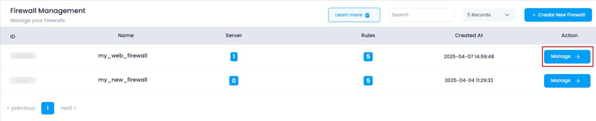
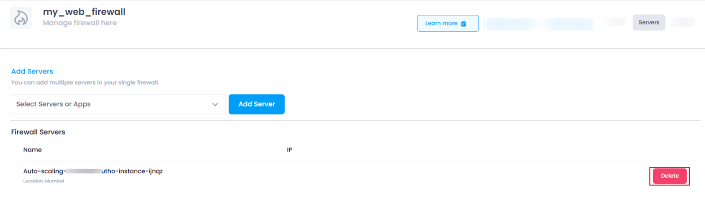
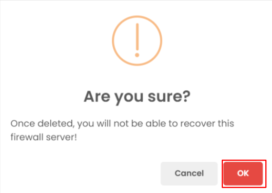

# **How to Delete Servers from Firewall**

This guide will show you how to remove servers from your firewall. If you no longer need a server to be connected to the firewall, you can easily remove it by following these steps.

### **1. Log in to Utho Cloud Platform**

* Visit the Utho Cloud Platform's **[login page](https://console.utho.com/login "Login Page")** .
* Enter your credentials and click  **Login** .
* If you're not registered, sign up **[here](https://console.utho.com/signup)** .

### **2. Navigate to the Firewall Listing Page**

* After logging in, go to the  **Firewall Listing Page** , where all the firewalls deployed in your account are listed.
* You can directly access this page by clicking [here](https://console.utho.com/firewall "Firewall List Page").

### **3. Select the Firewall to Manage**

* Find the firewall from which you want to remove a server.
* Click the **"Manage"** button next to the selected firewall to go to its manage page.

  

### **4. Go to the Servers Section**

* On the **Manage Page** of the firewall, click on the **"Servers"** tab at the top-right corner to open the **Servers** section.

### **5. Identify the Server to Remove**

* In the **Servers** section, you will see a list of all the servers currently attached to the firewall.
* Each server in the list will have a **"Delete"** button at the end of the item.

### **6. Delete the Selected Server**

* Click the **"Delete"** button next to the server you want to remove.
* A confirmation popup will appear asking you to confirm the deletion of the server.

  

### **7. Confirm the Deletion**

* Click **OK** on the popup to confirm and delete the server from the firewall.

  

### **8. Verify the Deletion**

* After the deletion, the server will no longer appear in the list of attached servers in the **Servers** section.
* You can verify by checking the updated list to ensure the server is no longer connected to the firewall.

By following these steps, you can easily manage and delete servers from your firewall in Utho Cloud.
