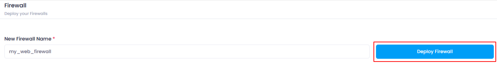
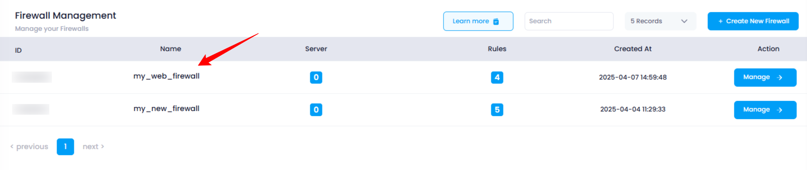

# **How to Deploy a Firewall**

### **Overview** 

A **firewall** in the Utho Cloud platform is a security feature that monitors and controls incoming and outgoing network traffic based on defined security rules. It is essential for protecting cloud resources from unauthorized access and potential threats. Firewalls can be deployed easily and managed through the Utho Cloud dashboard.

---

### **1. Login to Utho Cloud Platform**

* Visit the **[Utho Cloud Platform Login](https://console.utho.com/login)** page.
* Enter your credentials and click  **Login** .
* If you're not registered, sign up  **[here](https://console.utho.com/signup)** .

### **2. Navigate to Firewall Listing Page**

* After logging in, go to the  **Firewall Listing Page**  or you can click [here](https://console.utho.com/firewall "Firewall Listing Page").
* You will see a list of all the firewalls that have been deployed in your account.

### **3. Create a New Firewall**

* On the  **Firewall Listing Page** , you will see a button at the top of the list titled  **"Create New Firewall"** .
* Click on the **"Create New Firewall"** button.

  

This will redirect you to the  **Firewall Deployment Page** .

### **4. Enter Firewall Name**

* On the  **Firewall Deployment Page** , you’ll need to enter the **Name** for your new firewall.
  * This is the identifier for your firewall within Utho Cloud.
  * Choose a name that helps you easily identify the firewall, especially if you plan on managing multiple firewalls.

### **5. Deploy the Firewall**

* After entering the  **Firewall Name** , click the **"Deploy Firewall"** button.
* This will initiate the firewall deployment process.

  

### **6. Firewall Deployment Success**

* Upon successful deployment, you will be redirected to the  **Firewall Management Page** .
  * Here, you can manage your newly deployed firewall, view its details, and configure rules.
* You will also see a success toast notification confirming that the firewall has been deployed.

### **7. Verify Firewall Deployment**

* To verify if the firewall has been deployed successfully, you can return to the  **Firewall Listing Page** .
* The newly created firewall should now appear in the listing with its details, including its status and any configured rules.

  

---

### **What Happens After Deploying a Firewall**

After deploying a firewall, the firewall will be active, and you can configure specific security rules such as inbound and outbound traffic, IP addresses, and ports. This allows you to control access to your cloud resources and enhance your security posture.

---

## **Conclusion**

Deploying a firewall in Utho Cloud is a straightforward process that helps you protect your cloud resources from unauthorized access and potential threats. Once deployed, you can easily manage firewall rules, monitor traffic, and ensure that your resources are secure.
