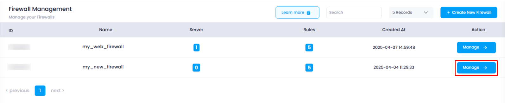
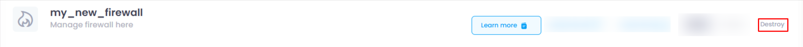
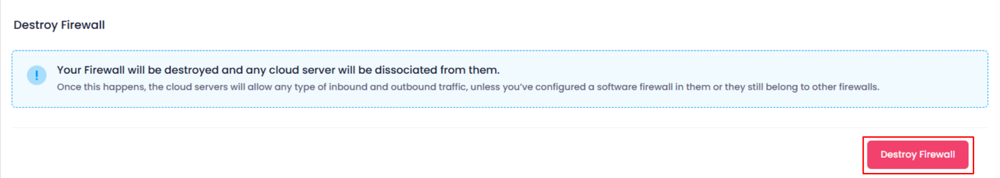
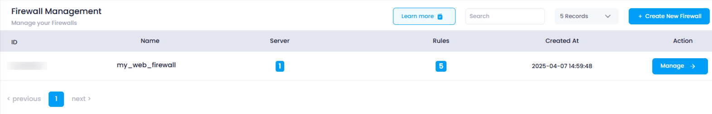

# **How to Destroy Firewall**

This guide will show you how to destroy a firewall and dissociate it from any cloud servers associated with it. Once destroyed, the firewall will be permanently deleted, and any servers connected to it will no longer be protected by that firewall.

### **1. Log in to Utho Cloud Platform**

* Visit the Utho Cloud Platfom's **[login page](https://console.utho.com/login)** .
* Enter your credentials and click  **Login** .
* If you're not registered, sign up  **[here](https://console.utho.com/signup)** .

### **2. Navigate to the Firewall Listing Page**

* After logging in, go to the  **Firewall Listing Page**.
* Here all the firewalls deployed in your account are listed.
* You can directly access this page by clicking [here](https://console.utho.com/firewall "Firewall Listing Page").

### **3. Select the Firewall to Manage**

* Find the firewall that you want to destroy.
* Click the **"Manage"** button next to the selected firewall to go to its manage page.

  

### **4. Go to the "Destroy" Tab**

* On the **Manage Page** of the firewall, click the **"Destroy"** tab in the top-right corner of the page.
* The content for the **Destroy** section will load.

  

### **5. Read the Destruction Warning**

* The page will show the following warning:
  * **Destroying the firewall will dissociate any attached cloud servers, which will then allow all inbound and outbound traffic unless they have a software firewall or are attached to another firewall.**

### **6. Click the "Destroy Firewall" Button**

* A red colored **"Destroy Firewall"** button will be visible.
* Click on this button to initiate the destruction process.

  

### **7. Confirm the Deletion**

* A confirmation popup will appear asking you to confirm the destruction of the firewall.
* Click **OK** to confirm.

  

### **8. Verify the Firewall Deletion**

* After the firewall is successfully destroyed, you will be redirected to the  **Firewall Listing Page** .
* You can verify that the firewall has been deleted by checking the list to ensure the firewall is no longer present.

  

By following these steps, you can easily destroy a firewall and remove any servers attached to it.
