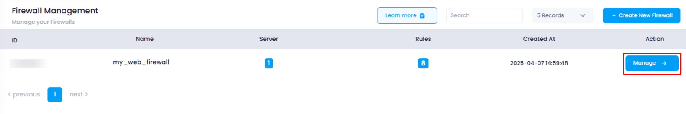
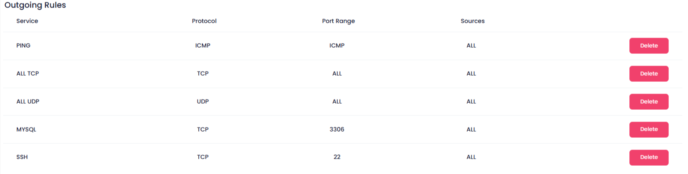
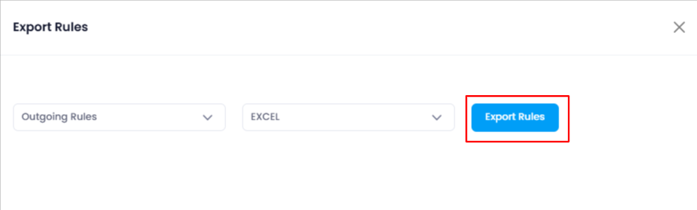
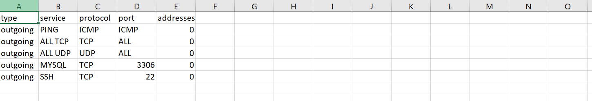

# **How to Export Firewall Rules**

This guide will show you how to export the current incoming and outgoing firewall rules to your local system in different formats (CSV, Excel, or PDF).

### **1. Log in to the Platform**

* Visit the Utho Cloud Platform's  **[login page](https://console.utho.com/login)** .
* Enter your credentials and click  **Login** .
* If you're not registered, sign up  **[here](https://console.utho.com/signup)** .

### **2. Navigate to the Firewall Listing Page**

* After logging in, go to the  **Firewall Listing Page** .
* Here, all the firewalls deployed in your account are listed.
* You can directly access this page by clicking [here](https://console.utho.com/firewall "Firewall Listing Page").

### **3. Select the Firewall to Manage**

* Find the firewall for which you want to export the rules.
* Click the **"Manage"** button next to the selected firewall to go to its manage page.

  

### **4. Go to the "Rules" Tab**

* On the **Manage Page** of the firewall, click on the **"Rules"** tab at the top-right corner of the page.
* This will display all the incoming and outgoing rules associated with the selected firewall.

  

### **5. Click on the "Export Rules" Button**

* At the top of the the page, locate the **"Export Rules"** button and click it.
* This will open a popup for you to choose export options.

  

### **6. Choose the Rules to Export**

* In the popup, you will see two dropdown options:
  1. **Select Rule Type** : Choose whether you want to export **Incoming** or **Outgoing** rules.
  2. **Select File Format** : Choose the format for the exported file, which can be  **CSV** ,  **Excel** , or  **PDF** .

### **7. Export the Rules**

* After selecting the appropriate options, click the **"Export Rules"** button.
* The system will prepare the selected rules and download the file to your local system in the chosen format.

  

### **8. Verify the Download**

* Check your local system's download folder to verify that the firewall rules have been successfully downloaded in the selected file format.

  
