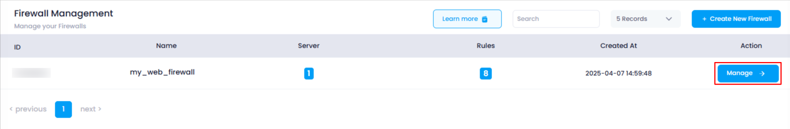
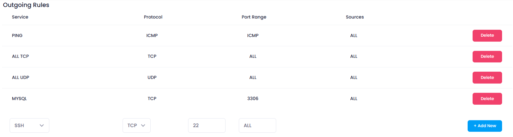
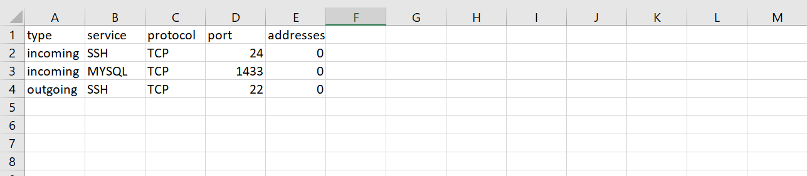
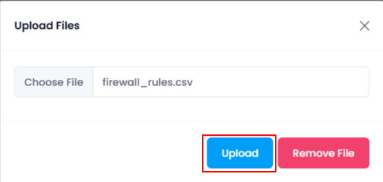
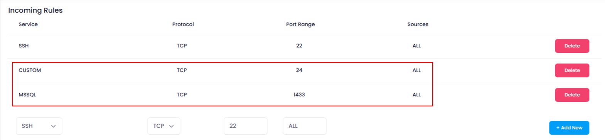
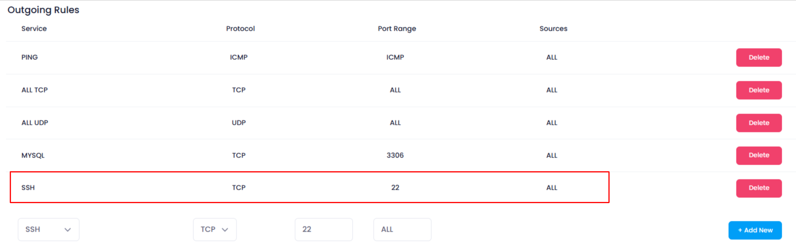

This guide will show you how to upload custom firewall rules using a .csv file, allowing you to quickly add multiple rules for both incoming and outgoing traffic.

### **1. Log in to the Platform**

* Visit the Utho Cloud Platform's  **[login page](https://console.utho.com/login)** .
* Enter your credentials and click  **Login** .
* If you're not registered, sign up  **[here](https://console.utho.com/signup)**.

### **2. Navigate to the Firewall Listing Page**

* After logging in, go to the  **Firewall Listing Page** .
* Here, all the firewalls deployed in your account are listed.
* You can directly access this page by clicking [here](https://console.utho.com/firewall "Firewall Listing Page").

### **3. Select the Firewall to Manage**

* Find the firewall that you want to upload rules for.
* Click the **"Manage"** button next to the selected firewall to go to its manage page.

  

### **4. Go to the "Rules" Tab**

* On the **Manage Page** of the firewall, you will automatically be on the **Rules** tab. If not, click on the **"Rules"** tab from the top-right corner of the page.

### **5. Click the "Upload Rules" Button**

* In the **Rules** section, click the **"Upload Rules"** button at the top of the page.
* This will open the file upload dialog where you can choose a .csv file containing your custom rules.

  

  

  

### **6. Prepare Your CSV File**

The .csv file should include the following columns:

* **Type** : Defines whether the rule is for incoming or outgoing traffic (e.g., "incoming" or "outgoing").
* **Service** : The service for which the rule applies, such as SSH, HTTP, MySQL, etc.
* **Protocol** : Usually TCP, but can be any protocol required (e.g., UDP).
* **Port** : The numerical value corresponding to the port for the selected service (e.g., 22 for SSH, 80 for HTTP).
* **Addresses** : The numeric IP addresses or address range that the rule applies to.

  

### **7. Select and Upload the CSV File**

* Choose the CSV file you have prepared and confirm your selection.
* The system will read the file and apply the rules automatically.

  

### **8. Verify the Rules**

* After the upload is complete, go back to the **Rules** tab of the  **Manage Page** .
* The uploaded rules will now be visible in the list of firewall rules.

  

  
