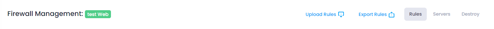
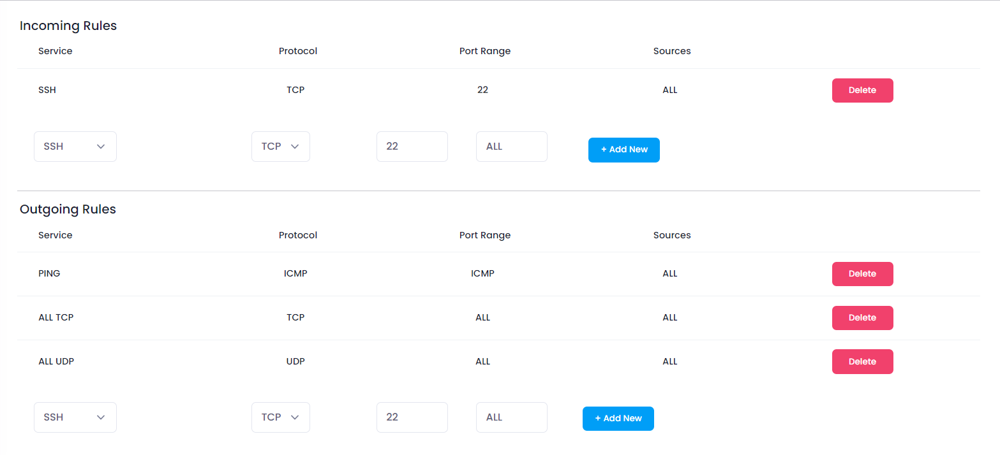
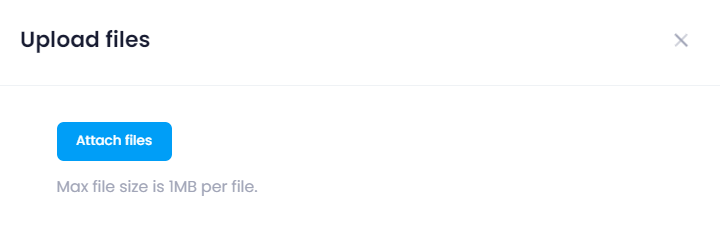
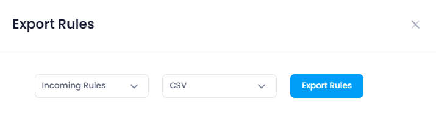
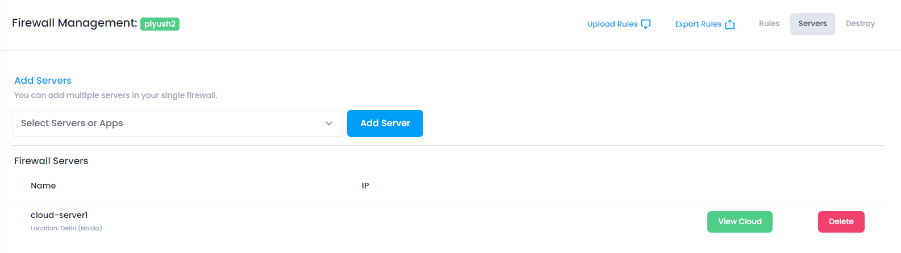

## Firewall Configuration Info

At the top of the Manage section, users can view the configuration information of the selected Firewall. This includes:

* **Firewall Name:** The unique name assigned to the Firewall.
<!-- * **Upload Rule:** Select a user from the list, click the **Upload Rule** button, which you will upload firewall rule into the firewall.
* **Export Rule:** Select a user from the list, click the **Export Rule** button, which you will export firewall rule from the firewall.
* **Rule:** Select a user from the list, click the **Rule** button, which you will add firewall rule manually into the firewall.
* **Sever:** Select a user from the list, click the **Sever** button, which you will add the selected firewall to that server.
* **Destroy:** Select a user from the list, click the **Sever** button, which you will add the selected firewall to that server.
* **Firewall Name:** The unique name assigned to the Firewall.
* **Firewall Name:** The unique name assigned to the Firewall.
* **Firewall Name:** The unique name assigned to the Firewall.
* **Firewall Name:** The unique name assigned to the Firewall.
* **Firewall Name:** The unique name assigned to the Firewall. -->

## Add Firewall Rules

In the Add Firewall Rules Section, users have the ability to add firewall and delete firewall. This section provides the following functionalities:

* **Add Firewall:** Click the **Add Firewall** button firewall will added to incoming and outgoing rules list after give reqiured details such as service, protocal, port range, source.
* **Delete:** Select a user from the list and click the **Remove** button to remove the incoming and outgoing rules from the Firewall.

## Upload Firewall Rules

In the Upload Firewall Rules Section, users have the ability to uploads input and outgoing firewall rules. This section provides the following functionalities:

* **Attach File:** Click the **Attach File** button you will upload file after select the rules type like incoming or outgoing and file type like .csv,.pdf,.xlsv.

## Export Firewall Rules

In the Export Firewall Rules Section, users have the ability to export input and outgoing firewall rules. This section provides the following functionalities:

* **Export Rule:** Click the **Export Rule** button you will export file like .csv,.pdf,.xlsv, which contain incoming and outgoing rules.

## Server

In the Server section, users have the ability to add a firewall to the server. This section provides the following functionalities:

* **Add Server:** Click the **Add Server** button to add a firewall to the selected server from the dropdown menu.
* **View Cloud:** Click the **View Cloud** button to open the manage section of that cloud.
* **Delete:** Click the **Delete** button to remove the firewall from the server.
## Destroy

In the Destroy section, users can terminate the Firewall. This action is irreversible and will permanently delete the Firewall and all associated data. To destroy a Firwall

Click the **Destroy Firwall** button.

##### **Confirmation:**

A confirmation dialog will appear. Confirm the action to proceed with destroying the Firewall.

When you provide the confirmation then your Firewall Instance will destroy.
