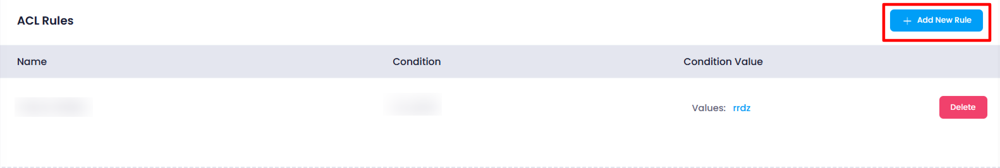
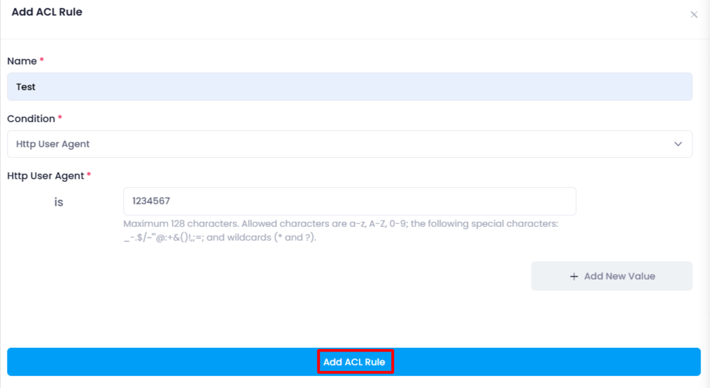

## Adding ACL Rules (For Application Server Type)

If the user selects **Application** as the server type during deployment then after clicking **Add Frontend**, the user will be prompted to **Add ACL Rules**.

### Add ACL Rules

**ACL rules** are used to control **traffic flow** between the load balancer and backend servers by allowing or denying access based on specific conditions (e.g., IP address, protocol, or request type).

- The user will be asked to define **Access Control List (ACL) Rules** for the selected application.
  Here user have to select name and condition for the acl rule creation.

  
- The rules will determine which requests are allowed or denied based on certain conditions.
- Once value is provided then click on **ADD ACL Rule** button , then rule will be created.

## **Explanation:-**

* **Name** :

 The **name** is a **unique identifier** for the ACL rule, used to label and organize it within the configuration. It helps easily identify and manage rules.      For example, a name could be "Allow_Admin_Access" to specify a rule allowing access to admin resources.

* **Condition** :

  The **condition** defines the **criteria** that must be met for the rule to be triggered. Common conditions include attributes like the  **source IP address** ,  **HTTP headers** ,  **URL path** , or **protocol** (e.g., HTTP, HTTPS). Conditions allow you to create rules based on traffic characteristics.
* **Condition Value** :

  The **condition value** is the **specific parameter** that the condition is checked against. For example, if the condition is based on the  **source IP** , the condition value might be `192.168.1.0/24` (allowing traffic from this IP range). Similarly, if the condition is a  **URL path** , the condition value could be `/admin/*` to target all paths under `/admin/`.
