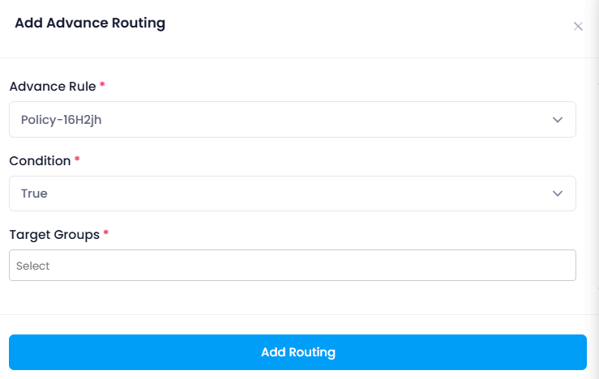

### Adding Advance Routing

- Now once the ACL rule is added then click on **Add new routing** then a side bar will open where you have to enter the data like, acl rule, condition and target group. Now after entering all the data click on **Add Routing** then routing will be created.

  

Once the Advance routing are added, they will be applied to the frontend configuration.

## **Explanation:-**

**Advanced routing** allows you to direct traffic based on specific criteria like  **URL paths** ,  **HTTP headers** ,  **query strings** , or  **cookies** . This ensures more  **efficient traffic distribution** , enables **personalization** (e.g., A/B testing), and optimizes resource usage. It provides greater **flexibility** in routing requests to the appropriate backend servers, improving **scalability** and  **performance** .

* **ACL Rule** : Filters traffic before it reaches the target group, ensuring security.
* **Condition** : Defines the rules for routing traffic to the correct target group based on request attributes (e.g., path, headers).
* **Target Group** : A **target group** is a set of backend resources (e.g., EC2 instances, containers, IP addresses) that the load balancer routes traffic to. When adding a target group, you specify the **protocol** and **port** for communication. It ensures that the load balancer directs traffic to the appropriate backend service for processing.
* When all details are filled then click on Advance Routing button , then rule will be created.
