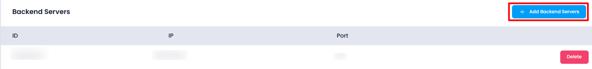
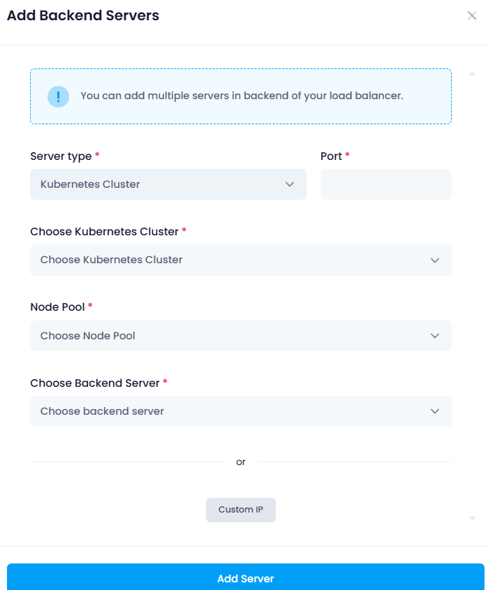

### Add Backend Server

A **backend server** in a load balancer processes traffic forwarded by the load balancer. It helps distribute the load, ensuring **scalability** and **high availability** by handling more traffic across multiple servers. By creating backend servers, users can improve  **performance** , prevent overload, and ensure **fault tolerance** in case of server failure.

Once the frontend is deployed, the **Frontend** section will include the option to **Add Backend Server**.

- When the user clicks **Add Backend Server**, they will be prompted to provide the following details:

  

  1. **Server Type**: Choose the type of backend server (e.g., Web Server, Database Server, etc.). Which you want to attach with the load balancer.
  2. **Port**: Specify the port number for the backend server.
  3. **Backend Server**: Select the backend server from the available options.
- After entering the required details, the user clicks **Add Server**.
- The newly **added** backend server will appear in the list of **Backend Servers**.

## Explanation:-

### **Use of Server Type, Port, Backend Server, and Custom IP in Load Balancer**

1. **Server Type** :

* **What it is** : The **server type** defines the type of backend server you're adding to the load balancer. This could be an  **application server** ,  **database server** , or any other type of resource that handles specific traffic.
* **Use** : Choosing the correct **server type** ensures the load balancer routes traffic to the appropriate resource based on its function (e.g., web server, database server).

2. **Port** :

* **What it is** : The **port** specifies the network port on the backend server where the load balancer should send traffic. For example, **port 80** for HTTP, **port 443** for HTTPS, or any custom port for specific services.
* **Use** : Configuring the **port** ensures that the load balancer directs traffic to the correct service on the backend server (e.g., web traffic to port 80, database queries to port 3306).

3. **Backend Server** :

* **What it is** : The **backend server** is the resource that will process the requests sent by the load balancer. This could be a virtual machine, container, or any service running in your network.
* **Use** : Adding a **backend server** to the load balancer allows the load balancer to distribute incoming traffic across multiple backend servers, ensuring **scalability** and  **high availability** .

4. **Custom IP** :

* **What it is** : A **custom IP** allows you to specify a **specific IP address** for a backend server, rather than using the default IP assigned by your cloud provider.
* **Use** : This is useful when you need to add a backend server that has a **static IP address** or when routing traffic to a **non-cloud resource** or a server outside your cloud environment. It ensures traffic is directed correctly, even if the server's IP address is fixed or specific.
