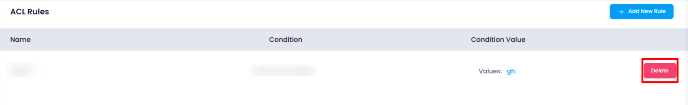

### **Deleting an ACL Rule**

To delete an **ACL Rule**, follow these steps:

1. **Navigate to the ACL Rule Listing** :

* Go to the **listing page** where all configured ACL rules are displayed.

1. **Click on the Delete Button** :

* Locate the ACL rule to be deleted and click on the **Delete** button next to it.

This ensures that the unwanted ACL rule is removed from the configuration without affecting other settings or traffic flows.
