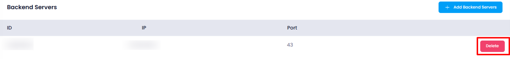
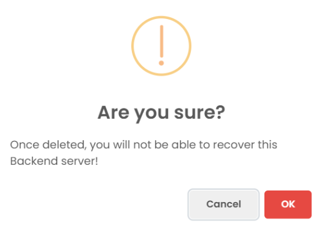

### **Deleting a Backend Server**

To delete a **backend server** , the user should follow these steps:

1. **Navigate to the Backend Server Listing** :

* Go to the **listing page** of backend servers where all attached servers are displayed.

1. **Click on the Delete Button** :

   

* Locate the backend server to be deleted and click on the **Delete** button next to it.

1. **Confirm Deletion** :

* A **confirmation message** will appear, asking the user to confirm the deletion.

1. **Confirm Deletion** :

   

* The user must click **"OK"** to confirm the action. Once confirmed, the backend server will be permanently deleted from the load balancer configuration.

This process ensures that the backend server is safely removed from the load balancer without impacting the overall system performance.
