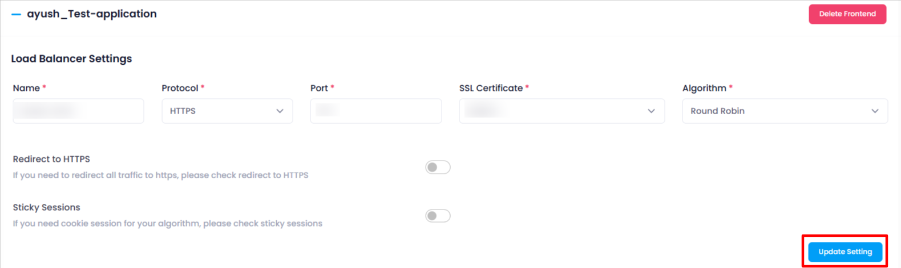

### **Updating Frontend Configuration** 

After the creation of a **frontend**, if the user wants to update its settings, follow these steps:

1. **Navigate to the Frontend Configuration** :

* Go to the **frontend configuration page** where the existing frontend settings are displayed.

1. **Modify the Settings** :

* Update the required fields such as protocols, ports, SSL settings, or any other relevant configuration.

1. **Click on Update Settings** :

* After making the necessary changes, click the **"Update Settings"** button to apply the modifications.

1. **Successful Update** :

* Once the update is successful, the frontend configuration will be updated with the new settings.

This process allows users to make adjustments to the frontend configuration without needing to recreate it, ensuring smooth updates to the load balancing setup.
