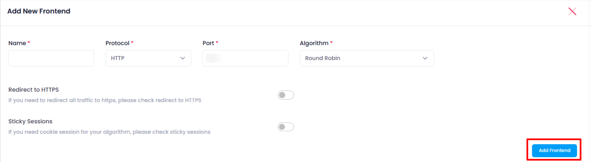

### Create Frontend

Creating a **frontend** in a load balancer is used to define how **incoming traffic** is received and processed. It specifies the  **protocol** , **port** , and  **traffic routing rules** , allowing the load balancer to manage client connections and distribute them to appropriate backend servers.

- To create a new frontend, the user needs to click on the **Create Frontend** button.
- After clicking **Create Frontend**, the user will be redirected to a new page where they must provide the following details:

  1. **Name**: Enter a name for the frontend.
  2. **Port**: Specify the port number.
  3. **Protocol**: Select the protocol (HTTP, HTTPS, TCP).
  4. **Algorithm**: Choose the load balancing algorithm (Round Robin, Least Connections, etc.).
- Additionally, the user has the option to choose the following settings:

  - **Redirect to HTTPS**: Enable this option to redirect HTTP traffic to HTTPS.
  - **Sticky Sessions**: Enable sticky sessions to ensure a user's requests are sent to the same backend server.
- After entering all the details and selecting the desired settings, the user clicks **Add Frontend**.
- Once the frontend is successfully created, it will appear in the list of configured frontends.
- If the user selects **HTTPS** as the protocol, they will be asked to provide **additional data**:

  1. **SSH Key**: The user will be prompted to add an SSH key for secure communication.

  - **If no SSH key is available**:
    - The system will display an option to **Add SSH Key**.
    - Upon clicking **Add SSH Key**, the user will be redirected to the **SSH Key Page**, where they can create or upload an SSH key.
- After entering all the required details (including SSH key if applicable), the user can click **Add Frontend**.
- Once the **frontend** is **successfully created**, it will appear in the list of configured frontends.

---

## Explanation:

### Port:

A **port** is a communication endpoint used by a load balancer to receive traffic from clients. When creating a frontend in a load balancer, the port defines where the load balancer listens for incoming requests (e.g., port 80 for HTTP, port 443 for HTTPS). It helps route traffic to the correct backend server based on the protocol and service being used. Ports ensure the load balancer knows which service to forward traffic to. Custom ports can also be used for non-standard applications or services.

### **Frontend Protocol Dropdowns (HTTP, HTTPS, TCP)**

1. **HTTP (Hypertext Transfer Protocol)** :

* **What happens** : The load balancer will handle **unencrypted web traffic** on port 80. It forwards incoming HTTP requests from clients (such as browsers) to backend servers.
* **Use case** : Suitable for websites or applications where  **encryption is not required** , or the traffic will be encrypted at a later stage (e.g., SSL termination at the backend).

1. **HTTPS (Hypertext Transfer Protocol Secure)** :

* **What happens** : The load balancer will handle **encrypted web traffic** on port 443. It establishes a secure **SSL/TLS connection** with clients, ensuring data security.
* **Use case** : Used when secure communication is needed, such as for  **financial applications, login pages** , or any service that requires data privacy and encryption.

1. **TCP (Transmission Control Protocol)** :

* **What happens** : The load balancer handles **raw TCP traffic** and forwards it to backend servers without any application-level protocol (like HTTP/HTTPS). This allows the load balancer to work with any application protocol that uses TCP.
* **Use case** : Typically used for applications like  **databases** ,  **mail servers** , or any service that operates over **non-HTTP protocols** (e.g., MySQL, FTP, custom TCP-based protocols).

### **Use of Creating Frontend with Different Protocols** :

* **HTTP/HTTPS** : Ideal for web applications, where the load balancer handles HTTP requests, including SSL termination (for HTTPS) to reduce backend load.
* **TCP** : Useful for non-HTTP applications that require low-level transport control, allowing traffic for any service using TCP-based communication protocols.

## Algorithm

**Round Robin** and **Least Connections** are **load balancing algorithms** that determine how incoming requests are distributed across backend servers. Here's a more specific explanation:

### **1. Round Robin Algorithm in Load Balancer** :

* **How it works** : The load balancer distributes incoming requests to backend servers in a  **sequential, circular manner** . It sends the first request to Server 1, the second to Server 2, the third to Server 3, and once it reaches the last server, it loops back to Server 1.
* **Use case** : Best for **stateless applications** where each request is independent, and each server has  **similar performance** . It works well when there’s no need to consider server load or capacity.

### **2. Least Connections Algorithm in Load Balancer** :

* **How it works** : The load balancer routes incoming traffic to the backend server that has the  **fewest active connections** . This method ensures that servers that are less busy or handling fewer requests are given new traffic, helping to balance the load more efficiently.
* **Use case** : Ideal for **stateful applications** where backend servers might have different capacities or varying workloads. It’s especially effective when servers have **uneven load** or the requests require more processing time.

---
