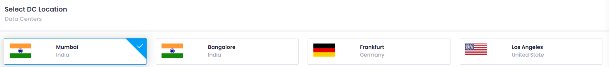
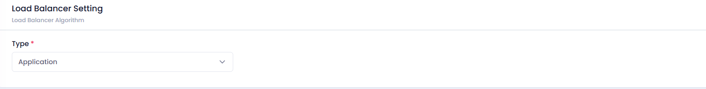
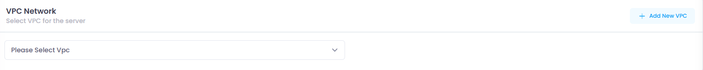
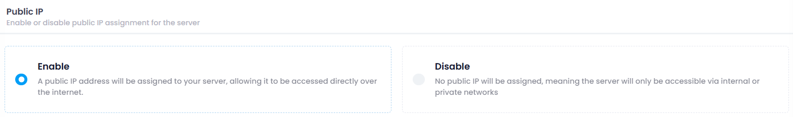
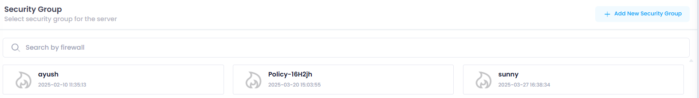
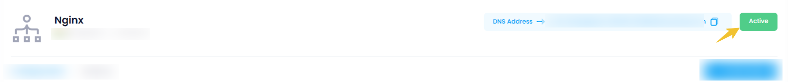

# **How to create Load Balanacer**

# **Login or Sign Up**

1. Visit the **Utho Cloud Platform** [login ](https://console.utho.com/login)page.
2. Enter your credentials and click  **Login**.
3. If you’re not registered, sign up [here](https://console.utho.com/signup).

---

## **Step 1: Access the Load Balanacer**

1. Open the **Utho Cloud Platform** dashboard.
2. Click **"Load Balanacer"** in the sidebar.
3. You’ll be redirected to the **Load Balancer** listing page.
4. Navigate to the **listing** of Load Balancer and click on **[Create Load Balancer](https://console.utho.com/loadbalancer/deploy)**.

### Steps to Create Load Balancer

#### Configure Load Balancer Settings:

Here you can configure your Load Balancer deployment details .

1. **Datacenter Location:** Choose the desired datacenter location from the dropdown menu.

   **DC Location** stands for  **Data Center Location** , which refers to the physical location of a data center, where servers, networking equipment, and other IT infrastructure are housed to support cloud services, websites, applications, and more

   
2. **Load Balancer Setting:** Select Load Balancer Setting from dropdown select either **Application or Network.

   The **Load Balancer Settings** refer to the configuration options and parameters that can be adjusted to control how the load balancer manages traffic, handles failures, secures connections, and ensures optimal routing.

   
3. **VPC Network:** Now select **vpc** and **subnet (**if available**)** for your load balancer.

   A **VPC (Virtual Private Cloud)** in load balancer deployment provides an isolated network where the load balancer and other resources are deployed. **Subnets** within the VPC allow you to organize resources, with **public subnets** used for internet-facing load balancers and **private subnets** for internal services. The load balancer in a **public subnet** routes traffic from the internet to backend resources in private subnets. Security groups and route tables manage access and traffic flow. Proper VPC and subnet configuration ensures scalability, high availability, and security for your load balancer and resources.

   
4. **Public IP:** Select public IP assignment for the server either enable or disable.

   A **public IP** serves a crucial role in determining how the load balancer interacts with external traffic, particularly from the internet. The option to **enable or disable** a public IP address is important depending on whether you want the load balancer to be accessible externally or not.a **public IP** serves a crucial role in determining how the load balancer interacts with external traffic, particularly from the internet. The option to **enable or disable** a public IP address is important depending on whether you want the load balancer to be accessible externally or not.

   
5. **Security Group:** Add security group for your server.

   A **Security Group** in a load balancer acts as a virtual firewall, controlling inbound and outbound traffic to the load balancer. It defines which IP addresses and ports are allowed to access the load balancer. Security groups also manage communication between the load balancer and backend resources. They provide essential security by ensuring that only authorized traffic can reach the load balancer and backend instances.

   
6. **Load Balancer Name:** Enter a unique name for your Load Balancer.

   Providing a **load balancer name** helps with **easy identification** and **management** of resources, especially in large environments. It also aids in **troubleshooting** and **automation** by linking issues and tasks to specific load balancers.

   
7. **Create Load Balancer:** Click the **Create Load Balancer** button on the center to create your Load Balancer.

   

#### Verify Deployment:

Your Load Balancer should now be active and visible in the list of deployed Load Balancers.

Here you can see your deployed load balancer with configuration details your provided during the deployment process and you can manage you load balancer by clicking on mange button, for detailed info check for the manage load balancer section in the Utho docs.

#### **Support**

For additional help with **Load Balancer** or if you encounter any issues, contact **Utho Support** through:

- The **Support Ticket System**
- Email: 📩 **[support@utho.com](support@utho.com)**

---
