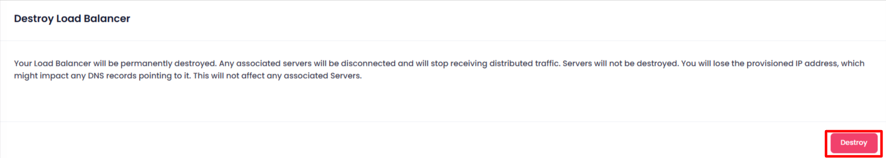
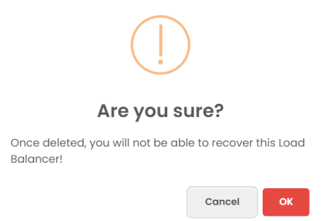

## Destroying Lodbalancer

In the Destroy section, users can terminate the Load Balancer. This action is irreversible and will permanently delete the Load Balancer and all associated data. To destroy a Load Balancer

Click the **Destroy Load Balancer** button.

##### **Confirmation:**

A confirmation dialog will appear. Confirm the action to proceed with destroying the Load Balancer.

When you provide the confirmation then your Load Balancer Instance will destroy.
