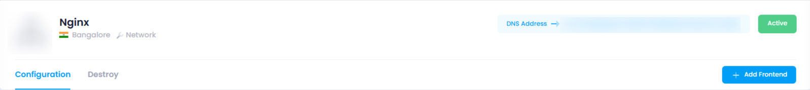

## Overview of manage Section:

### 1. Configuration :

The **Load Balancer Configuration** in Utho Cloud allows users to set up and manage frontend and backend traffic distribution. Users can configure frontends with protocols like HTTP, HTTPS, TCP,  and enable SSL termination for secure connections. Backend servers can be added, with health checks and session persistence options to ensure reliability. Access Control List (ACL) rules provide security by defining inbound and outbound traffic restrictions. Advanced routing options allow traffic to be directed based on content, headers, or request methods, ensuring flexible and optimized load balancing for applications.

### 2. **Destroy** :

* **Definition** : **Destroying** an Load Balancer in Utho refers to permanently deleting the volume and all the data stored within it. Once destroyed, the lb cannot be recovered unless you have a **backup** or **snapshot** of the data.
* **Example** : When you no longer need an Load Balancer, you can destroy it to free up resources and avoid incurring unnecessary costs.
