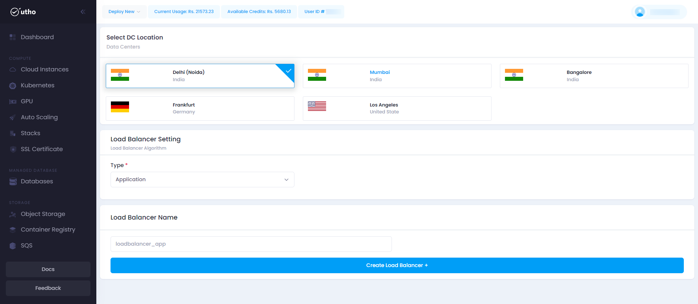

## Initial Start

* **Log in** to your account on our platform.
* **Navigate** to the top toolbar and locate the **Deploy** dropdown menu.
* **Select** the **Load Balancer** option from the dropdown.

## Quick Start

#### Open the Load Balancer Deployment Page:

Click on the **Deploy** dropdown in the top toolbar and select  **Load Balancer** .

After click on the above load balancer button a load balancer-deploy page will open

#### Configure Load Balancer Settings:

here you can configure your Load Balancer deployment details .

1. **Datacenter Location:** Choose the desired datacenter location from the dropdown menu.
2. **Load Balancer Name:** Enter a unique name for your Load Balancer.
3. **Load Balancer Setting:** Select Load Balancer Setting.
4. **Create Load Balancer:** Click the **Create Load Balancer** button on the right side to create your Load Balancer.

#### Verify Deployment:

Your Load Balancer should now be active and visible in the list of deployed Load Balancers.

here you can see your deployed load balancer with configuration details your provided during the deployment process and you can manage you load balancer by clicking on mange button, for detailed info check for the manage load balancer section in the Utho docs.
