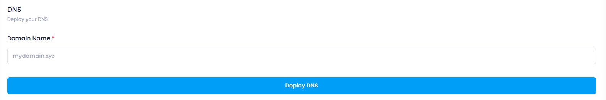

# **How to create Managed DNS**

## **Login or Sign Up**

1. Go to the **Utho Cloud Platform** [login](https://console.utho.com/login) page.
2. Enter your credentials and click  **Login** .
3. If you don't have an account, sign up [here](https://console.utho.com/signup).

---

## **Accessing Managed DNS**

1. Open the **Utho Cloud Platform** dashboard.
2. Click on **"Managed DNS"** in the sidebar.
3. You will be redirected to the **Managed DNS** listing page.
4. Click on **[Deploy DNS](https://console.utho.com/dns/deploy "E")** to open the deployment page.

On the  **Deploy Page** , configure the following:

Fill in the **Domain Name**  A new page will open. In this page, enter the domain name for which you want to create the DNS.

Click on **"Deploy DNS**   After filling in the domain name, click the "Deploy DNS" button.

**Benefits of Deploying DNS**

1. **Faster Website Access**: Deploying DNS ensures that your domain name resolves to the correct IP address, improving website loading speed.
2. **Improved Reliability**: Managed DNS providers offer redundancy, failover, and high availability, reducing the risk of downtime.
3. **Scalability**: Easily handle increased traffic by scaling DNS services without needing to manage the underlying infrastructure.
4. **Better Security**: DNS deployment includes features like DDoS protection, DNSSEC, and fraud prevention to secure your domain.
5. **Simplified Management**: Deploying DNS via a managed service simplifies the process of adding, updating, and managing DNS records.
6. **Geo-Localization**: Direct traffic to the closest server based on the user's location, improving website performance globally.

##### **Verify DNS Creation**

The DNS will be created, and you will be redirected  to the manage page also the newly created DNS will now be visible in the list on the homepage of the Managed DNS service.

