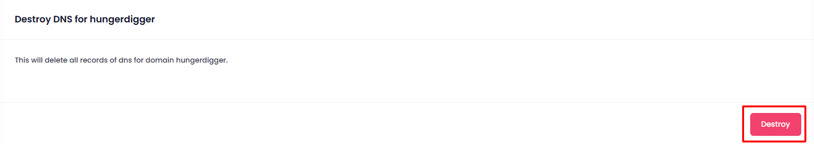
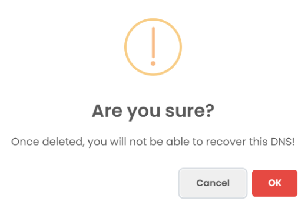

Destroy DNS Record in Managed DNS

1. **Navigate to the Destroy Section**:

   - On the Managed DNS dashboard, go to the **Destroy** section where you manage DNS deletion.
2. **Click on the Destroy Button**:

   - In the Destroy section, click the **Destroy** button next to the DNS record you wish to delete.

   
3. **Pop-up for Confirmation**:

   - A confirmation pop-up will appear to ensure that you want to permanently delete the DNS record.

   
4. **Confirm Deletion**:

   - Confirm the action in the pop-up by clicking **OK**.
5. **DNS Deletion**:

   - Once confirmed, the DNS record will be permanently deleted from the system.
