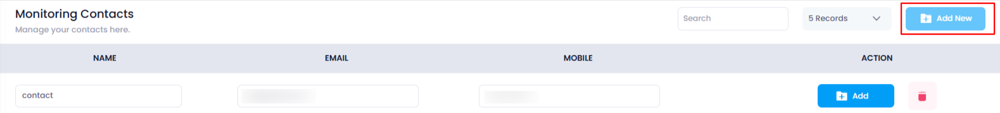
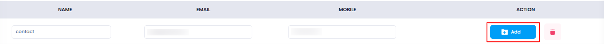
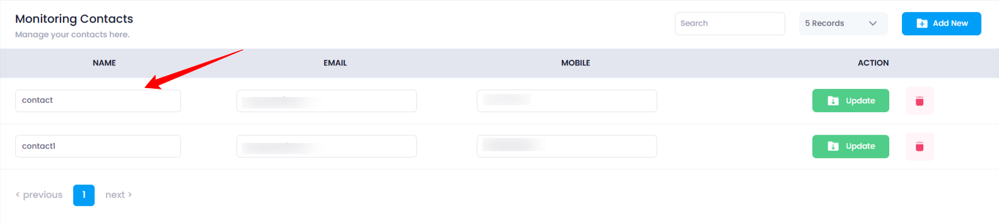

## **How to Add Monitoring Contact**

This guide will show you how to add a new monitoring contact in your Utho Cloud Platform. A monitoring contact allows you to manage alerts and notifications for your cloud resources.

### **1. Log in to Utho Cloud Platform**

* Visit the Utho Cloud Platform's  **[login page](https://console.utho.com/login)** .
* Enter your credentials and click  **Login** .
* If you're not registered, sign up  **[here](https://console.utho.com/signup)** .

### **2. Navigate to the Monitoring Listing Page**

* After logging in, go to the  **Monitoring Listing Page** .
* You can directly access this page by clicking [here](https://console.utho.com/monitoring "Monitoring Listing Page").

### **3. Go to the "Monitoring Contacts" Tab**

* On the  **Monitoring Listing Page** , you will find a tab labeled  **"Monitoring Contacts"** .
* Click on this tab to view the content.

  

### **4. Click on "Add New"**

* In the **Monitoring Contacts** section, click the **"Add New"** button.

### **5. Fill in the Contact Information**

* A new set of input fields will appear. Fill in the following details for the new contact:

  * **Name** : Enter the name of the contact.
  * **Email** : Enter the email address of the contact.
  * **Mobile** : Enter the mobile number of the contact.

  **Note** : All these fields are required and must be unique. No name, email, or mobile number should match with any existing contact.

  

### **6. Click on "Add" to Save the Contact**

* Once you have filled in all the fields, click the **"Add"** button adjacent to the input fields to add the contact.

  

### **7. Verify the New Contact**

* After clicking  **"Add"** , the contact will be saved.
* To verify the addition, you can check the **Monitoring Contacts** list to see if the newly added contact is displayed.

  

By following these steps, you can easily add a new monitoring contact to your Utho Cloud Platform.
