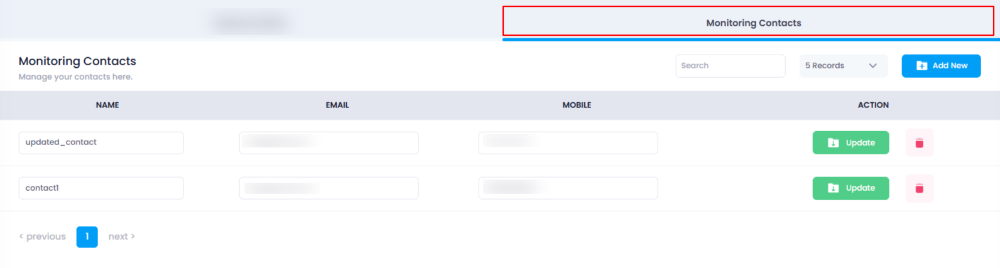
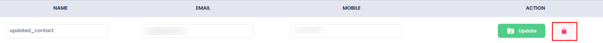
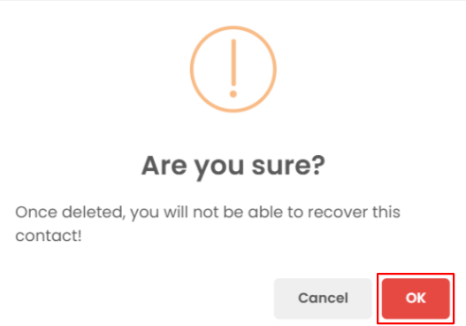
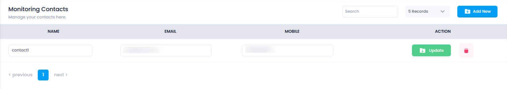

## **How to Delete Monitoring Contact**

Monitoring Contacts are essential for alert notifications. If you need to delete any contact, follow the steps below:

### **1. Log in to Utho Cloud Platform**

* Visit the Utho Cloud Platform's  **[login page](https://console.utho.com/login)** .
* Enter your credentials and click  **Login** .
* If you're not registered, sign up  **[here](https://console.utho.com/signup)** .

### **2. Navigate to the Monitoring Listing Page**

* After logging in, go to the  **Monitoring Listing Page** .
* You can directly access this page by clicking [here](https://console.utho.com/monitoring "Monitoring Listing Page")

### **3. Go to the "Monitoring Contacts" Tab**

* On the  **Monitoring Listing Page** , click on the **"Monitoring Contacts"** tab.
* This will show you a list of all previously added monitoring contacts.

  

### **4. Select the Contact to Delete**

* In the list of contacts, locate the contact you wish to delete.
* Next to each contact, you will see a **Delete icon** (usually represented as a trash bin).

  

### **5. Confirm Deletion**

* Click on the **Delete icon** next to the contact you wish to remove.
* A confirmation popup will appear, asking you to confirm the deletion.
  * In the popup, click the **"OK"** button to confirm.

    

### **6. Verify the Deletion**

* Once you confirm the deletion, the contact will be removed from the list.
* The list will automatically refresh, and you can verify that the contact has been deleted by checking the contact list again.

  

By following these steps, you can easily delete monitoring contacts from the Utho Cloud Platform.
