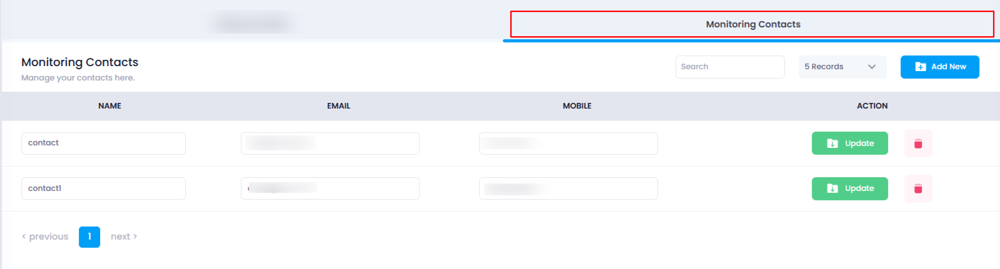
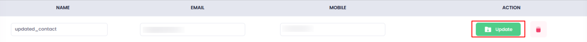
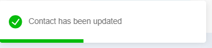
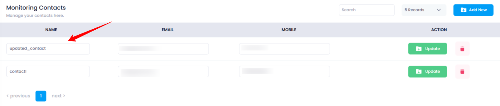

## **How to Update Monitoring Contact**

Monitoring Contacts are crucial for receiving important alerts related to your cloud resources. If you need to update any contact details, such as name, email, or mobile number, follow the steps below to update them in the Utho Cloud Platform.

### **1. Log in to Utho Cloud Platform**

* Visit the Utho Cloud Platform's  **[login page](https://console.utho.com/login)** .
* Enter your credentials and click  **Login** .
* If you're not registered, sign up  **[here](https://console.utho.com/signup)** .

### **2. Navigate to the Monitoring Listing Page**

* After logging in, go to the  **Monitoring Listing Page** .
* You can directly access this page by clicking [here](https://console.utho.com/monitoring "Monitoring Listing Page").

### **3. Go to the "Monitoring Contacts" Tab**

* On the  **Monitoring Listing Page** , you will find a tab labeled  **"Monitoring Contacts"** .
* Click on this tab to view the list of all previously added monitoring contacts.

  

### **4. Select the Contact to Update**

* In the **Monitoring Contacts** section, you will see a list of all monitoring contacts.
* Each contact in the list will be displayed in editable input fields by default (name, email, and mobile number).
* Locate the contact you want to update.

### **5. Update the Contact Details**

* In the editable input fields, make the necessary changes to the contact’s:
  * **Name**
  * **Email**
  * **Mobile number**

    **Note** : All these fields are required and must be unique. No name, email, or mobile number should match with any existing contact.

### **6. Save the Changes**

* After making the necessary edits, click the green-colored **"Update"** button next to the contact.
* Clicking on the **"Update"** button will save your changes.

  

### **7. Verify the Updates**

* Once the contact is updated, the list will refresh automatically.
* You can verify that your changes have been saved by checking the updated details in the list.

  

  

By following these steps, you can easily update the details of your monitoring contacts.
