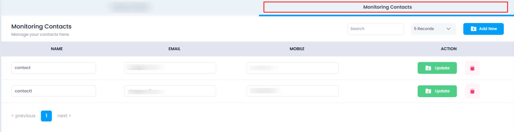

## **How to View Monitoring Contacts**

Monitoring Contacts are used to receive alerts and notifications regarding the status of your cloud resources. These contacts play a key role in ensuring that the right people are informed about the health and performance of the cloud servers and other resources, so timely actions can be taken to resolve any issues. By adding monitoring contacts, you can ensure that the relevant team members or stakeholders are notified in case of any critical events or thresholds being reached.

This guide will show you how to view the list of previously added monitoring contacts in your Utho Cloud Platform.

### **1. Log in to Utho Cloud Platform**

* Visit the Utho Cloud Platform's  **[login page](https://console.utho.com/login)** .
* Enter your credentials and click  **Login** .
* If you're not registered, sign up  **[here](https://console.utho.com/signup)** .

### **2. Navigate to the Monitoring Listing Page**

* After logging in, go to the  **Monitoring Listing Page** .
* You can directly access this page by clicking [here](https://console.utho.com/monitoring "Monitoring Listing Page").

### **3. Go to the "Monitoring Contacts" Tab**

* On the  **Monitoring Listing Page** , you will find a tab labeled  **"Monitoring Contacts"** .
* Click on this tab to view the list of all previously added monitoring contacts.

### **4. View the Contacts List**

* The **Monitoring Contacts** section will display a list of all monitoring contacts that have been previously added.
* The list includes details like:
  * **Name** of the contact
  * **Email** address
  * **Mobile** number

    

You can easily scroll through the list to find any previously added contacts.

By following these steps, you can easily view all your existing monitoring contacts.
