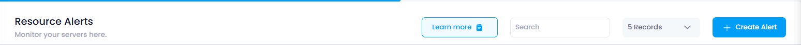
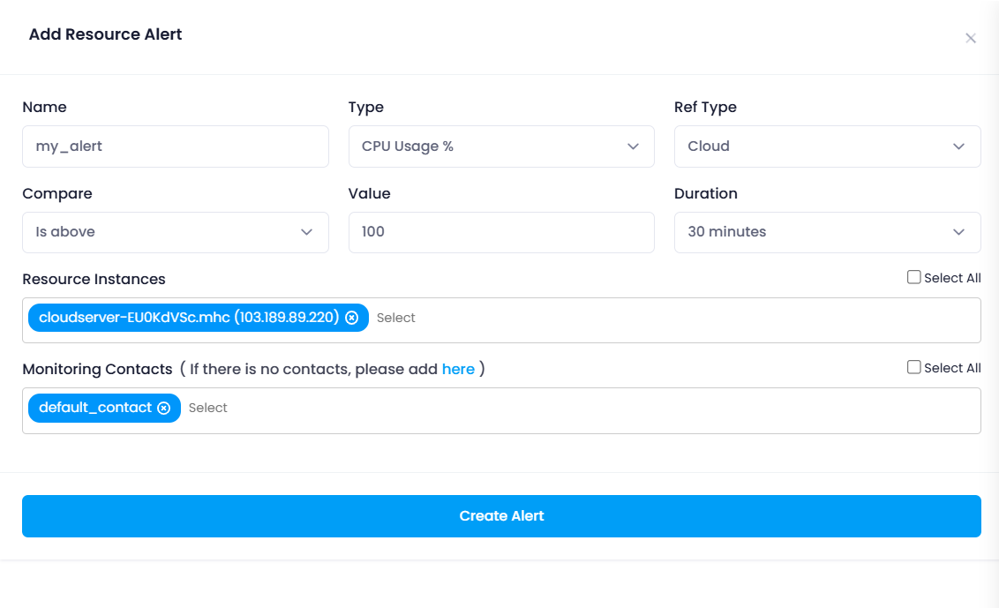
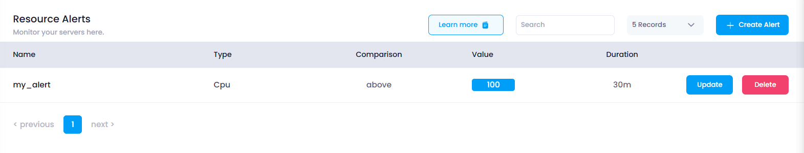

## **How to Create Resource Alert**

This guide will show you how to create a resource alert to monitor various system parameters such as CPU usage, memory utilization, disk activity, and network performance on your Utho Cloud platform. Resource alerts help ensure that your infrastructure is performing as expected and notify you when certain thresholds are reached.

### **1. Log in to Utho Cloud Platform**

* Visit the Utho Cloud Platform's  **[login page](https://console.utho.com/login)** .
* Enter your credentials and click  **Login** .
* If you're not registered, sign up  **[here](https://console.utho.com/signup)** .

### **2. Navigate to the Monitoring Listing Page**

* After logging in, go to the **Monitoring Listing Page** to view and manage your monitoring settings.
* You can access this page directly via the **Monitoring** tab or by clicking  **[here](https://console.utho.com/monitoring "Monitoring Resource Listing")** .

### **3. Go to the "Resource Alerts" Tab**

* By default, the **"Resource Alerts"** tab will be selected.
* If it is not already selected, click on the **"Resource Alerts"** tab to load the resource alerts section.

  

### **4. Click on "Create Alert"**

* At the top of the **Resource Alerts** list, there is a **"Create Alert"** button.
* Click on this button to open a drawer for creating a new resource alert.

### **5. Fill in the Resource Alert Parameters**

The drawer will display the following fields for creating the resource alert:

* **Name** :
  * Enter a unique name for the resource alert. This name will help you easily identify and manage your alert in the list.
* **Type** :
* This dropdown allows you to select the resource type you want to monitor. The options include:
  * **CPU Utilization %** : Monitors the percentage of CPU usage.
  * **Memory Utilization %** : Monitors the percentage of memory usage.
  * **Disk Write MB/s** : Monitors the rate of data written to the disk in megabytes per second.
  * **Disk Read MB/s** : Monitors the rate of data read from the disk in megabytes per second.
  * **Network** : Monitors the network traffic (in/out).
* **Ref Type** :
  * This field is pre-set to **"Cloud"** and cannot be changed, as the resource alert applies to cloud-based resources.
* **Compare** :
* This dropdown allows you to choose the comparison condition for triggering the alert:
  * **Is Below** : Trigger the alert if the resource value is lower than the specified threshold.
  * **Is Equal To** : Trigger the alert if the resource value equals the specified threshold.
  * **Is Above** : Trigger the alert if the resource value exceeds the specified threshold.
* **Value** :
  * Enter the numeric threshold value that will trigger the alert when the selected resource metric (CPU, Memory, Disk, etc.) meets the specified condition. For example, you could enter "80" for CPU utilization to be alerted when CPU usage exceeds 80%.
* **Duration** :
* This dropdown allows you to select the duration for which the condition should persist before triggering the alert. Options include:
  * **5 minutes**
  * **10 minutes**
  * **30 minutes**
  * etc.
* **Resource Instance** :
  * This dropdown allows you to select the cloud servers you wish to monitor. You can select multiple cloud servers for the resource alert.
* **Monitoring Contacts** :
  * If you have previously created monitoring contacts, you can select one or more contacts to receive notifications for this resource alert. If no monitoring contacts are created, you must first create them before proceeding.

    

### **6. Click "Create Alert"**

* Once all the fields are filled out and the desired settings are configured, click the **"Create Alert"** button to create the resource alert.

### **7. Verify the Resource Alert**

* After clicking the **"Create Alert"** button, the alert will be added to the resource alerts list.
* The page will refresh, and you can verify the newly created resource alert by checking the **"Resource Alerts"** tab again. You should see the new alert listed with the parameters you set.

  
