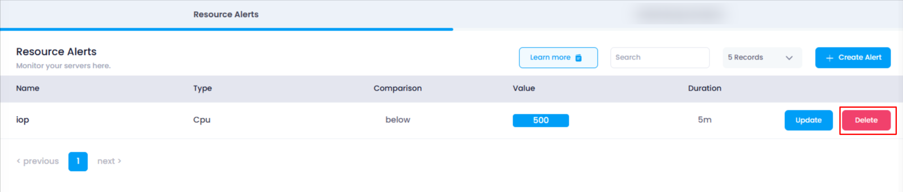
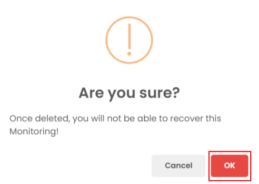
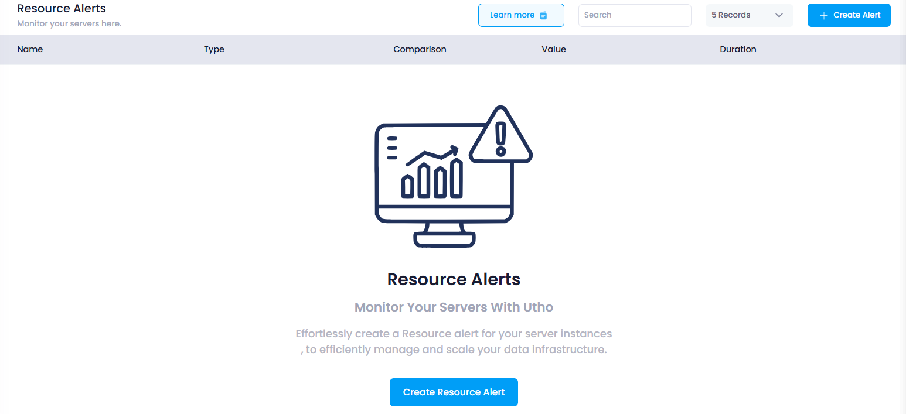

## **How to Delete Resource Alert**

This guide will walk you through the steps to delete a resource alert in your Utho Cloud platform. Deleting an alert ensures that it no longer monitors the selected resource, and you will no longer receive notifications for the alert condition.

### **1. Log in to Utho Cloud Platform**

* Visit the Utho Cloud Platform's  **[login page](https://console.utho.com/login)** .
* Enter your credentials and click  **Login** .
* If you're not registered, sign up  **[here](https://console.utho.com/signup)** .

### **2. Navigate to the Monitoring Listing Page**

* After logging in, go to the **Monitoring Listing Page** where you can manage all your monitoring settings.
* You can access this page directly via the **Monitoring** tab or by clicking  **[here](https://console.utho.com/monitoring "Monitoring Listing Page")** .

### **3. Go to the "Resource Alerts" Tab**

* In the  **Monitoring Listing Page** , the **"Resource Alerts"** tab will be selected by default. If it's not, click on it to load the resource alerts section.
* Here, you will see a list of all your existing resource alerts.

### **4. Click on the "Delete" Button**

* At the end of each resource alert in the list, there will be a **"Delete"** button.
* Click on the **"Delete"** button next to the resource alert you wish to remove. This will open a confirmation popup.

  

### **5. Confirm the Deletion**

* A confirmation popup will appear asking if you're sure you want to delete the resource alert.
* Click **"OK"** in the confirmation popup to confirm the deletion.

  

### **6. Verify the Deletion**

* Once you confirm the deletion, the resource alert will be deleted.
* The **Resource Alerts** list will refresh, and you can verify that the resource alert has been removed by checking the list again. If the alert no longer appears, it has been successfully deleted.

  
