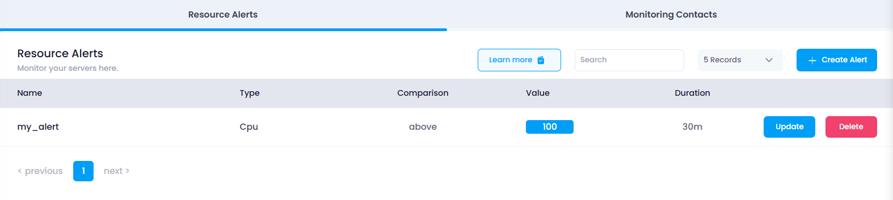
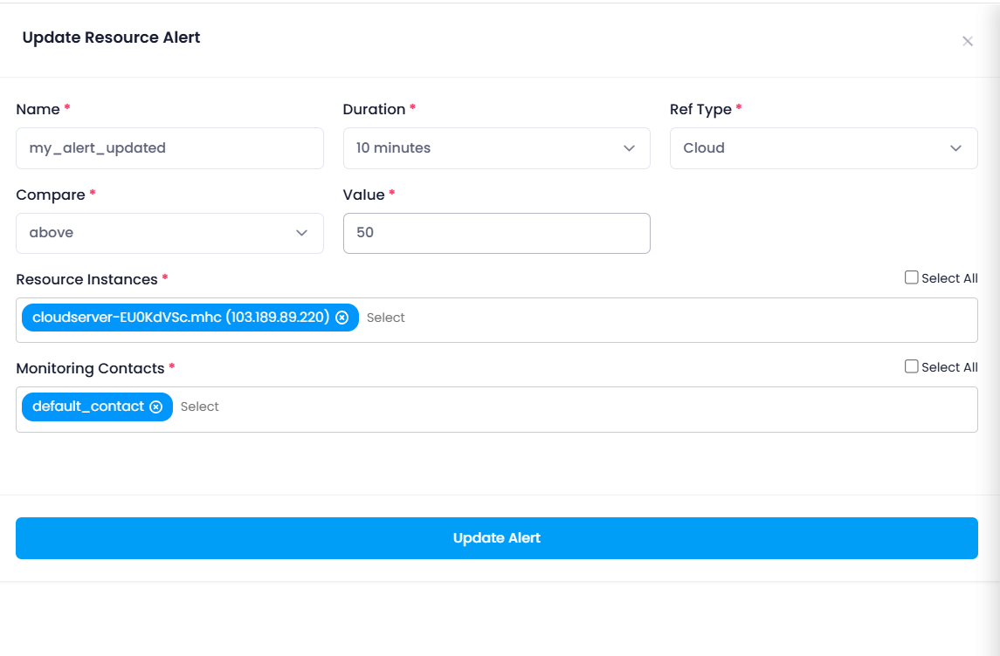
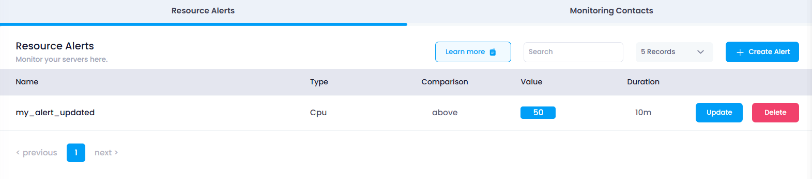

## **How to Update Resource Alert**

This guide will walk you through the steps to update an existing resource alert in your Utho Cloud platform. By updating a resource alert, you can modify parameters like the type of resource, threshold values, duration, and more, to better fit your monitoring needs.

### **1. Log in to Utho Cloud Platform**

* Visit the Utho Cloud Platform's  **[login page](https://console.utho.com/login)** .
* Enter your credentials and click  **Login** .
* If you're not registered, sign up  **[here](https://console.utho.com/signup)** .

### **2. Navigate to the Monitoring Listing Page**

* After logging in, go to the **Monitoring Listing Page** where you can manage your monitoring settings.
* You can access this page directly via the **Monitoring** tab or by clicking  **[here](https://console.utho.com/monitoring "Monitoring Listing Page")** .

### **3. Go to the "Resource Alerts" Tab**

* In the  **Monitoring Listing Page** , the **"Resource Alerts"** tab will be selected by default. If it's not, click on it to load the resource alerts section.
* Here, you will see a list of all your existing resource alerts.

### **4. Click on the "Update" Button**

* At the end of each resource alert in the list, there will be an **"Update"** button.
* Click on this **"Update"** button next to the resource alert that you want to update. This will open a drawer where you can modify the alert's configurations.

  

### **5. Modify the Resource Alert Settings**

The drawer will display all the settings for the selected resource alert. You can update any of the following parameters:

* **Name** : Change the name of the resource alert to something more relevant or meaningful.
* **Type** : Modify the resource type you are monitoring, such as switching between CPU Utilization, Memory Utilization, Disk Read/Write, or Network.
* **Compare** : Adjust the comparison condition to  **Is Below** ,  **Is Equal To** , or **Is Above** depending on how you want the alert to trigger.
* **Value** : Modify the threshold value that will trigger the alert when the monitored resource reaches or exceeds the set value.
* **Duration** : Change the duration for which the alert condition should persist before the alert is triggered.
* **Resource Instance** : Add or remove cloud servers that should be monitored by the resource alert.
* **Monitoring Contacts** : Update or change the monitoring contacts who should receive notifications for this alert.

  

### **6. Click "Update Alert"**

* After making the necessary changes to the configuration, click the **"Update Alert"** button to save your changes.

### **7. Verify the Updated Resource Alert**

* Once you click the **"Update Alert"** button, the resource alert will be updated.
* The **Resource Alerts** list will refresh, and the updated settings will be reflected for the selected resource alert.
* You can verify your updates by checking the list of resource alerts again to ensure your changes have been applied correctly.

  
