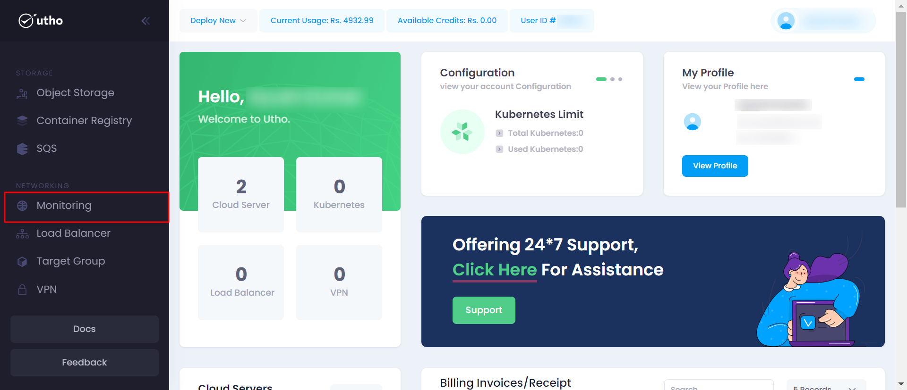
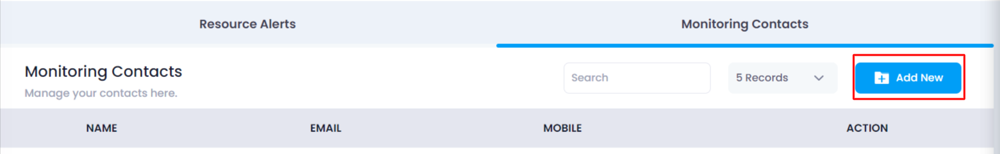
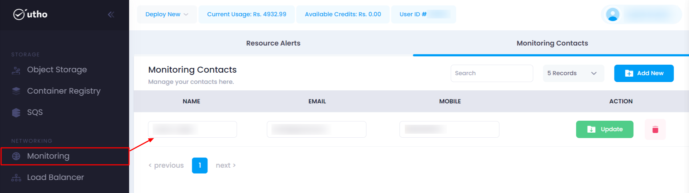
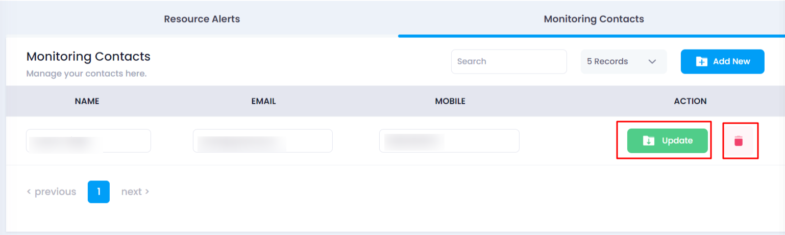
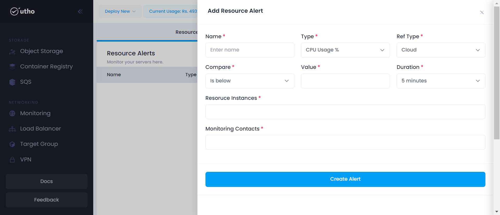
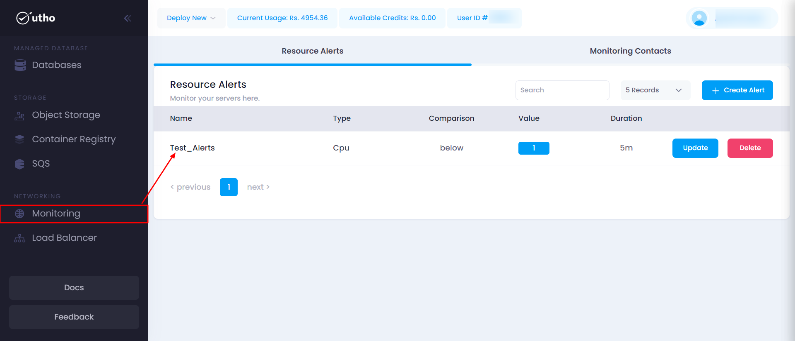
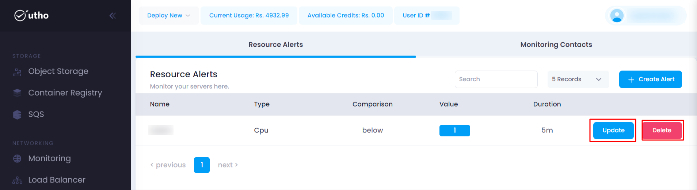

### Initial Start

- Log in to your accout on our platform.
- Navigate to the sidebar here every product is mentioned.
- Select the Monitoring  option from the sidebar.

### Quick Start

1. **Open the Monitoring deployment page:**

- Click on the sidebar and select Monitoring.

After clicking on Monitoring a new page will open.

2. **Configure Monitoring :**
 Here you can configure your Monitoring deployment details after clicking on **Monitoring Contacts** .
 

    click on **Add New** as shown and enter the details.
    **Name:** Enter a unique name for your contact.
    **Email:** Enter a email for your contact.
    **Mobile Number:** Enter a unique Mobile Number for your contact.

**Adding Contacts:**
- After clicking on "Add Contact," a new contact will be generated and displayed in the list below.

    

**Updating Contacts:**
- Later, by clicking on "Update," users can modify existing contacts.

    

3. **Configure Resource Alerts.**
 Here you can configure your Resource Alerts deployment details after clicking on **Create Alert** .

- Fill all the details and click on **Create Alerts.**
    **Name:** Enter a unique name for your alert.
    **Type:**    
**System:**
- Alerts categorized under "System" typically pertain to issues or events related to the overall system health. This could include server outages, high CPU usage, memory issues, or other system-level failures.

**Network:**
Alerts categorized under "Network" focus on issues related to network infrastructure. This might involve network outages, high latency, packet loss, or security-related events such as suspicious network traffic.

**Value:**
Alerts categorized under "Value" could refer to specific metric thresholds or values that trigger an alert. For example, this could be used to monitor specific performance metrics (like response times, queue lengths, or database connections) that exceed predefined thresholds.

**Disk:**
Alerts categorized under "Disk" typically relate to storage and disk usage. This might include alerts for low disk space, disk errors, disk throughput exceeding normal limits, or failures in storage devices.

**Ref Type:** Select ref type from the dropdown.
**Compare:** Select any type of compare from  the dropdown.
**Value:** Input the  trigger the alert value.
**Duration:** Select the duration of alert from the dropdown.
**Resoruce Instances:** Select the resource instances from the dropdown.
**Monitoring Contacts:** Select the created Monitoring Contacts from the dropdown.

### Verify Deployment: 
Then created alert will be shown in the resource alerts list as marked below.

Additionally, users can update their alerts by clicking on the edit icon. Alerts can also be deleted by clicking on the delete icon.

---

