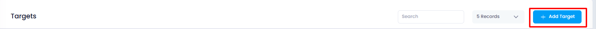
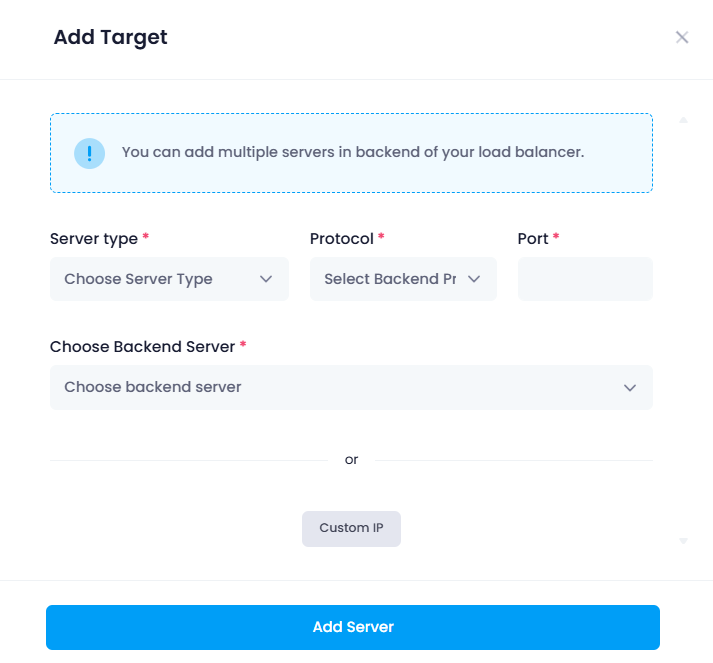
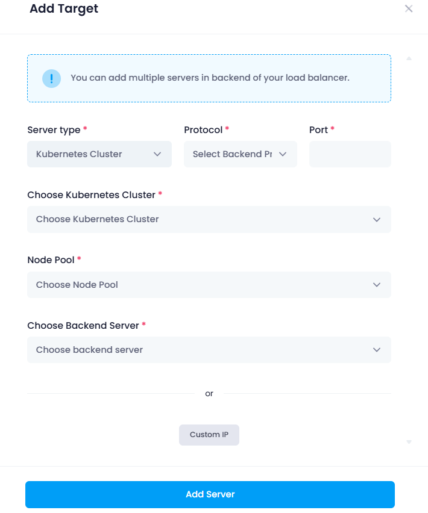
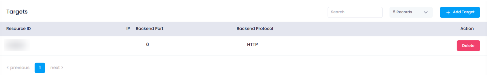

### Adding a Target in a Target Group

To add a target to a target group, follow these steps:

1. **Click on the "Add Target" Button** : In the **Target Section** of the target group, users should click the "Add Target" button to begin the process of adding a new target.

   
2. **Pop-up Window Appears** : A pop-up window will appear, prompting the user to configure the target settings.

   
3. **Choose Server Type** :

* **Cloud Server** : The user selects **Cloud** if they wish to choose a server from a cloud.
* **Kubernetes** : Alternatively, the user selects **Kubernetes** if they want to add a Kubernetes-based target.

1. **Select Protocol and Port** :

* The user then selects the appropriate **protocol** (e.g., HTTP, HTTPS, TCP) and **port number** (e.g., 80 for HTTP, 443 for HTTPS) that will be used for the connection.

1. **Choose Backend Server** :

* For  **Cloud** : The user selects the **backend server** from the available cloud resources.
* For  **Kubernetes** : The user must specify the **node pool** and **workers** to be used in the Kubernetes environment, which are the servers or containers running the application.

1. **Custom IP Option** (Optional):

   * If the user needs to use a **Custom IP** instead of a cloud or Kubernetes server, they can click on the **"Custom IP"** button. This will lead them to a new page where they can configure the IP address, protocol, and port.
   * On this page, the user will input the custom IP, select the protocol, and specify the port number.
2. **Click "Add Server"** : After configuring the server details, the user clicks on **"Add Server"** to add the target to the group.

   
3. **Target Added to the List** : Once the configuration is complete, the new target will be successfully added to the list of targets in the target group, and traffic will be routed accordingly based on the selected settings.

4. If user want to delete the target then just click on the delete button and select the confirmation to ok the it will be deleted.
