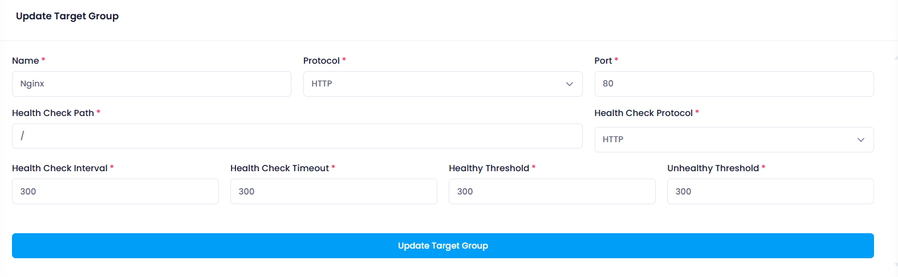

## Configuration

In the Configuration section, users can update the Target Group. This section provides the following functionalities:

* **Target Group Name:** Update a unique name for your Target Group.
* **Protocal:** Select protocal option from the dropdown for your Target Group.
* **Port:** Update the port for your Target Group.
* **Health Check Path:** Update the health check path for your Target Group.
* **Health Check Protocol:** Update health check protocol option from the dropdown for your Target Group.
* **Health Check Interval:** Update the health check interval for your Target Group.
* **Health Check Timeout:** Update the health check timeout for your Target Group.
* **Healthy Threshold:** Update the healthy threshold for your Target Group.
* **Unhealthy Threshold:** Update the nnhealthy threshold for your Target Group.
