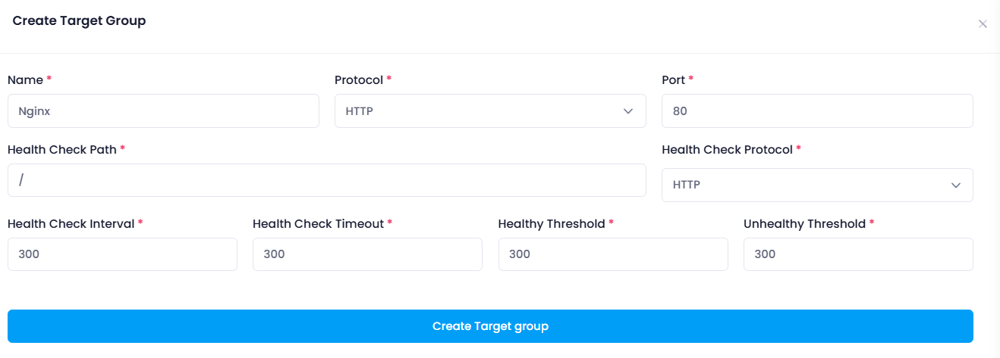
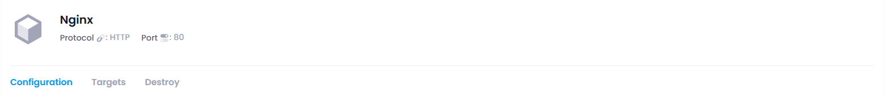

# **How to create Elastic Block Storage**

## **Login or Sign Up**

1. Go to the **Utho Cloud Platform** [login](https://console.utho.com/login) page.
2. Enter your credentials and click  **Login** .
3. If you don't have an account, sign up [here](https://console.utho.com/signup).

---

## **Accessing Target  Group**

1. Open the **Utho Cloud Platform** dashboard.
2. Click on **"Target  Group"** in the sidebar.
3. You will be redirected to the **Target Group** listing page.
4. Click on **[Create Target Group](https://console.utho.com/targetgroups)** to open the deployment page.

After click on the above Target Group button a Create Target Group sidebar page will open

### Steps to Target Group

After click on the above Target Group button a Create Target Group page will open

#### Configure Target Group Settings:

Here you can configure your Target Group deployment details .

1. **Target Group Name:** Enter a unique name for your Target Group.
2. **Protocal:** Select protocal option from the dropdown for your Target Group.
3. **Port:** Enter the port for your Target Group.
4. **Health Check Path:** Enter the health check path for your Target Group.
5. **Health Check Protocol:** Select health check protocol option from the dropdown for your Target Group.
6. **Health Check Interval:** Enter the health check interval for your Target Group.
7. **Health Check Timeout:** Enter the health check timeout for your Target Group.
8. **Healthy Threshold:** Enter the healthy threshold for your Target Group.
9. **Unhealthy Threshold:** Enter the unhealthy threshold for your Target Group.

#### Verify Deployment:

Your Target Group should now navigated to manage section and visible in the list of deployed Target Groups.

Here you can see your deployed Target Group with configuration details your provided during the deployment process and you can manage you Target Group by clicking on mange button, for detailed info check for the manage Target Group section in the Utho docs.

#### **Support**

For additional help with **Target Group** or if you encounter any issues, contact **Utho Support** through:

- The **Support Ticket System**
- Email: 📩 **[support@utho.com](support@utho.com)**

---
