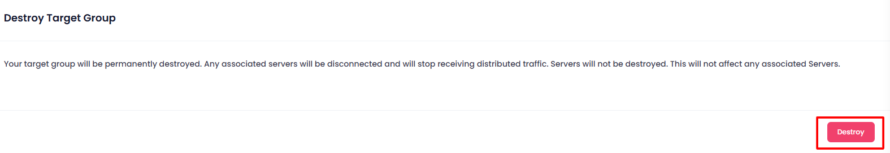
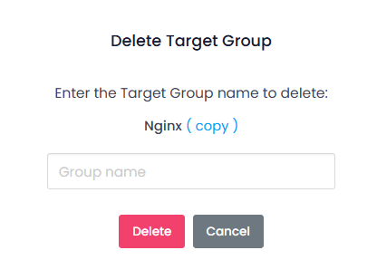

## Destroying Target Group

In the Destroy section, users can terminate the Target Group instance. This action is irreversible and will permanently delete the Target Group and all associated data. To destroy a Target Group

Click the **Destroy Target Group** button.

##### **Confirmation:**

A confirmation dialog will appear. Confirm the action to proceed with destroying the Target Group.

When you provide the confirmation then your Target Group Instance will destroy.
