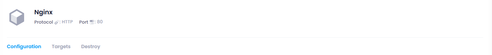

## Overview Section:

    

A **protocol** is a set of rules or standards that define how data is transmitted and received over a network. It determines the structure, format, and method of communication between devices or systems. Protocols ensure that devices or applications understand how to interpret and handle the data they send and receive.

A **port** is a logical endpoint used by protocols to route network traffic to the correct service or application on a device. When a device communicates over a network, it uses a combination of an **IP address** and a **port number** to specify which service or application should handle the incoming or outgoing data.

### Configuration Section

The **Configuration Section** in a target group is designed to facilitate the updating and management of the target group's settings and parameters. This section allows administrators to modify existing configurations or add new data relevant to the target group, such as adjusting health check settings, changing instance attributes, or updating routing rules. It ensures that the target group is optimized for performance and can adapt to changing requirements.

### Target Section

The **Target Section** specifies the servers or resources that the target group will connect to. This section allows administrators to select and manage the individual instances, virtual machines, or endpoints that are part of the target group. By defining the targets, the system can effectively distribute traffic, monitor performance, and ensure that the correct resources are utilized for handling incoming requests.

### Destroy Section

The **Destroy Section** is used to permanently delete the target group if it is no longer needed. This action removes all configurations, associated resources, and any settings tied to the target group. It is an essential feature for maintaining resource management and ensuring that unused groups do not consume system resources or lead to potential security vulnerabilities.
