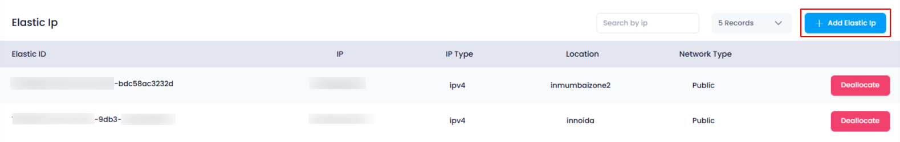
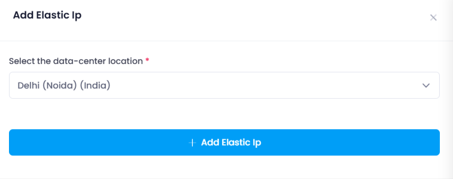
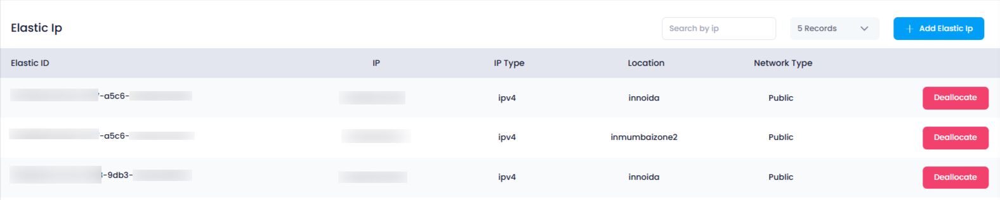

## **How to Add an Elastic IP in Utho Cloud**

### **Overview**

Adding an **Elastic IP** in Utho Cloud allows you to allocate a new static public IP address for use with your cloud resources, such as **NAT Gateways** or  **instances** . Elastic IPs provide a stable and persistent public IP address that can be reassigned or remapped across different resources. This guide will walk you through the steps to add a new Elastic IP to your Utho Cloud account.

---

### **1. Login to Utho Cloud Platform**

* Visit the **[Utho Cloud Login](https://console.utho.com/login)** page.
* Enter your credentials and click  **Login** .
* If you don’t have an account, sign up  **[here](https://console.utho.com/signup)** .

---

### **2. Navigate to the Elastic IPs Listing Page**

* After logging in, look for the **VPC** section in the  **left sidebar** .
* Click on **VPC** to open a submenu, then click on  **Elastic IPs** .
* This will take you to the  **Elastic IP Listing Page** , where you can view all the currently allocated Elastic IPs.
* To directly access the Listing page you can click [here](https://console.utho.com/vpc/elasticip "Elastic IP Listing Page").

---

### **3. Click on "Add Elastic IP" Button**

* On the  **Elastic IP Listing Page** , look towards the top of the page for the **"Add Elastic IP"** button.
* Click on this button to open a drawer where you can configure the new Elastic IP.

  

---

### **4. Select the Data Center Location**

* In the  **drawer** , you will see a dropdown menu to select the **Data Center** location for the new Elastic IP.
* Choose the desired **data center** location from the dropdown.
* The location selected determines where the Elastic IP will be allocated geographically, which is crucial for matching your resources' network and region.

---

### **5. Add the Elastic IP**

* After selecting the data center location, click on the **"Add Elastic IP"** button to initiate the allocation process.
* Utho Cloud will assign a new **Elastic IP** in the selected data center, and it will automatically appear in your Elastic IP listing once the process is complete.

---

### **6. Verify the Elastic IP**

* To verify the newly added  **Elastic IP** , return to the  **Elastic IP Listing Page** .
* The newly created IP should now appear in the list with the corresponding details, including the Elastic ID, IP address, type, location, and network type.

  

---

### **Conclusion**

By following these steps, you can easily add a new **Elastic IP** in Utho Cloud and allocate it to the desired **Data Center** location. This feature allows you to efficiently manage your cloud resources, providing persistent and stable public IP addresses. If you need further assistance or have questions about managing Elastic IPs, feel free to reach out!
