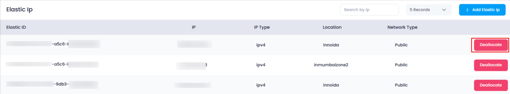
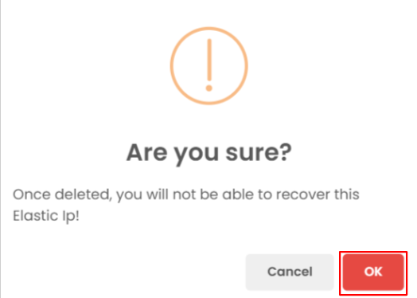
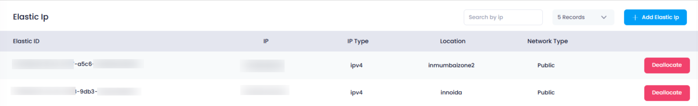

## **How to Delete an Elastic IP in Utho Cloud**

### **Overview**

Deleting an **Elastic IP** in Utho Cloud allows you to remove a previously allocated static public IP address that is no longer in use. This helps in optimizing your IP management and avoiding unnecessary charges. This guide will walk you through the steps to safely delete an existing Elastic IP from your Utho Cloud account.

---

### **1. Login to Utho Cloud Platform**

* Visit the **[Utho Cloud Login](https://console.utho.com/login)** page.
* Enter your credentials and click  **Login** .
* If you don’t have an account, sign up  **[here](https://console.utho.com/signup)** .

---

### **2. Navigate to the Elastic IPs Listing Page**

* After logging in, go to the **VPC** section in the  **left sidebar** .
* Click on  **VPC** , then select **Elastic IPs** from the submenu.
* This will take you to the  **Elastic IP Listing Page** , where you can view all currently allocated Elastic IPs.
* You can also directly access the page [here](https://console.utho.com/vpc/elasticip "Elastic IP Listing Page").

---

### **3. Locate the Elastic IP to be Deleted**

* On the  **Elastic IP Listing Page** , you will see a list of all your Elastic IPs with relevant details.
* Browse through the list to find the Elastic IP you wish to delete.

---

### **4. Click on the "Deallocate" Button**

* At the end of the row corresponding to the Elastic IP, you will see a **"Deallocate"** button.
* Click on the **Deallocate** button to initiate the deletion process.

  

---

### **5. Confirm the Deletion**

* A confirmation popup will appear asking if you are sure you want to delete the selected Elastic IP.
* Click **"OK"** in the popup to confirm the deletion.

  

---

### **6. Verify the Deletion**

* Once deleted, the Elastic IP will be removed from your listing.
* To verify, simply check the **Elastic IP Listing Page** again — the deleted IP should no longer appear in the list.

  

---

### **Conclusion**

By following these steps, you can easily delete an unused **Elastic IP** in Utho Cloud, helping keep your infrastructure clean and cost-efficient. Always ensure that the Elastic IP is no longer in use by any resources before deleting it. For any assistance or issues during this process, feel free to reach out to our support team!
