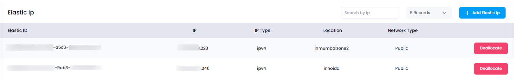

## **How to View Elastic IPs in Utho Cloud**

### **Overview**

Viewing **Elastic IPs** in Utho Cloud allows users to manage and monitor the static, public IP addresses assigned to their cloud resources. These IPs provide critical functionality, such as enabling internet access for cloud resources like **NAT Gateways** and  **instances** . This guide will walk you through the steps to access and view the listing of all **Elastic IPs** in your Utho Cloud account.

---

### **1. Login to Utho Cloud Platform**

* Visit the **[Utho Cloud Login](https://console.utho.com/login)** page.
* Enter your credentials and click  **Login** .
* If you're not registered yet, you can sign up  **[here](https://console.utho.com/signup)** .

---

### **2. Navigate to the Elastic IPs Listing Page**

* After logging in, on the  **left sidebar** , find the **VPC** section.
* Click on the **VPC** menu item to open a submenu.
* From the submenu, click on **Elastic IPs** to access the  **Elastic IP Listing Page** .
* Alternatively, you can directly access the Elastic IPs listing page by clicking on this [link to Elastic IPs Listing](https://console.utho.com/vpc/elasticip).

---

### **3. Elastic IPs Listing Page Overview**

Once you are on the  **Elastic IP Listing Page** , you will see a list of all the **Elastic IPs** associated with your account. The following information is displayed for each Elastic IP:

1. **Elastic ID** :

* The **Elastic ID** is a unique identifier assigned to each Elastic IP in your account.
* This helps differentiate between different Elastic IPs, particularly when managing multiple IPs or resources.

2. **IP** :

* The **IP** column shows the actual **IP address** assigned to the Elastic IP.
* This is the static public IP address used for communication with external services or for outbound traffic via  **NAT Gateways** .

3. **IP Type** :

* The **IP Type** indicates the type of IP address assigned, which is typically **IPv4** or other types depending on the configuration.
* In most cases, it will display  **IPv4** , which is the standard format for Elastic IPs in Utho Cloud.

4. **Location** :

* The **Location** field shows the **Data Center (DC) Location** where the Elastic IP is deployed.
* This helps you understand the geographical region where your IP is hosted, ensuring that your resources are located in the desired data center.

5. **Network Type** :

* The **Network Type** indicates whether the Elastic IP is **Public** or another type.
* Public Elastic IPs are exposed to the internet, while other types may be used for internal or specific configurations.

6. **Deallocate** :

* The **Deallocate** button allows you to deallocate (release) the Elastic IP.
* Deallocating an Elastic IP frees up the IP address and removes its association with any cloud resource, making it available for other uses.

---

### **Conclusion**

Viewing **Elastic IPs** in Utho Cloud is an essential part of managing your public IP addresses and cloud resources. The **Elastic IP Listing Page** provides an easy-to-navigate overview of all your allocated IPs, with key details such as Elastic ID, IP address, type, location, and network type. You can also deallocate any unused Elastic IPs directly from this page, providing flexibility and ease in managing your cloud networking resources.
