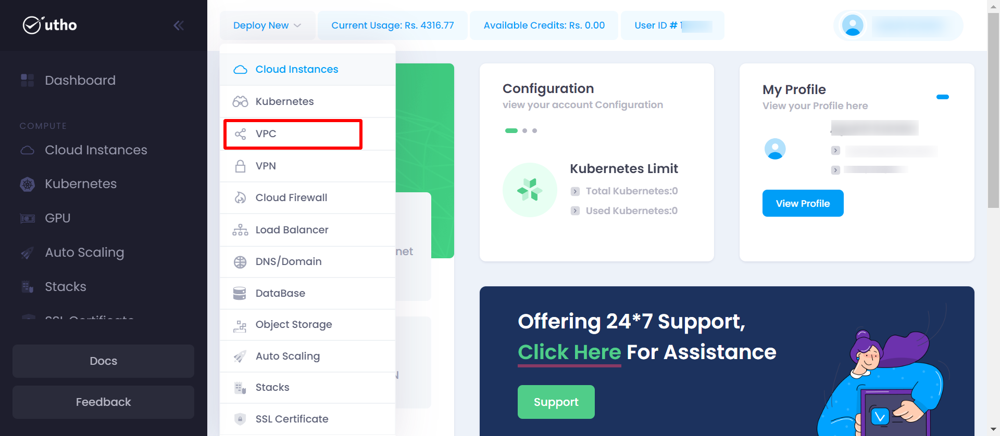
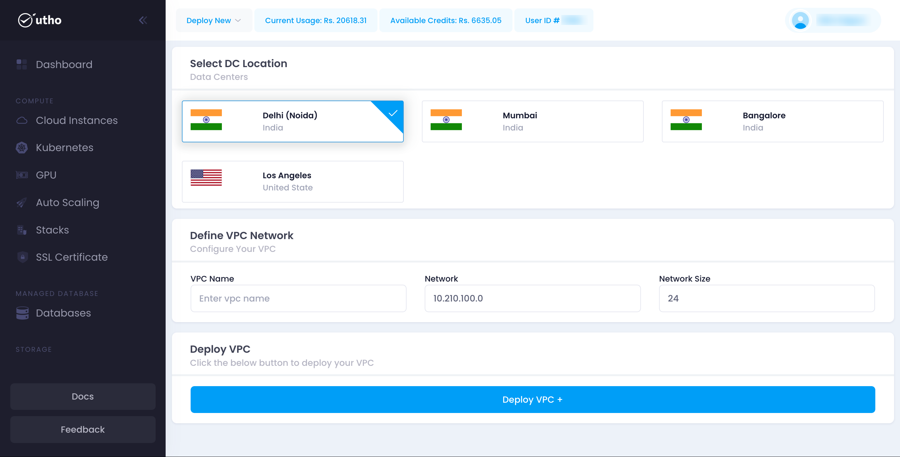
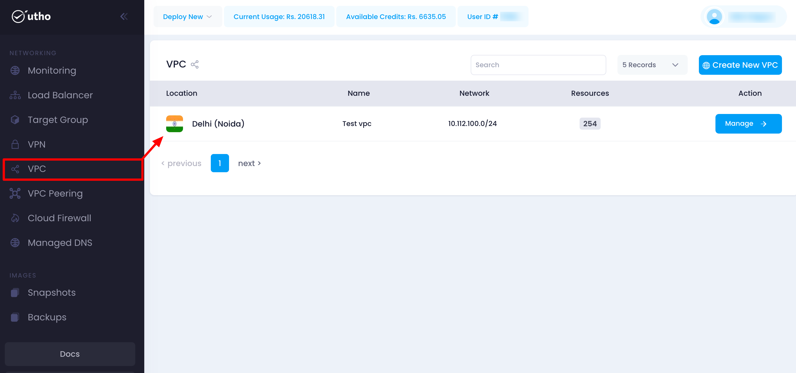

## Initial Start

* **Log in** to your account on our platform.
* **Navigate** to the top toolbar and locate the **Deploy** dropdown menu.
* **Select** the **VPC** option from the dropdown.

## Quick Start

#### Open the VPC Deployment Page:

Click on the **Deploy** dropdown in the top toolbar and select  **VPC** .

After click on the above vpn button a vpn-deploy page will open

#### Configure VPN Settings:

here you can configure your vpn deployment details .

1. **Datacenter Location:** Choose the desired datacenter location from the dropdown menu.
2. **VPC Name:** Enter a unique name for your VPC.
3. **VPC Network:** Specify the IP for vpc.
4. **Network Size:** Enter the vpc network size.
5. **Deploy VPC:** Click the **Deploy VPC** button on the right side to create your VPN.

#### Verify Deployment:

Your VPN should now be active and visible in the list of deployed VPNs.

here you can see your deployed vpc with configuration details your provided during the deployment process and you can manage you vpc by clicking on mange button, for detailed info check for the manage vpc section in the Utho docs.
