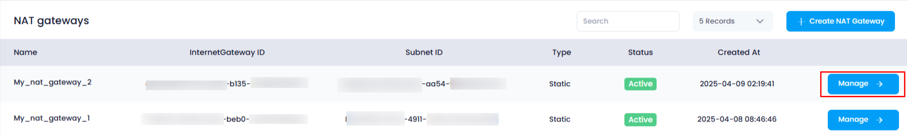
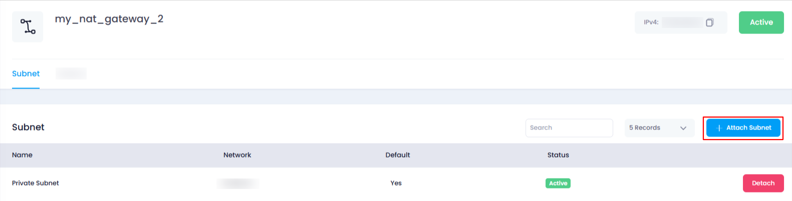
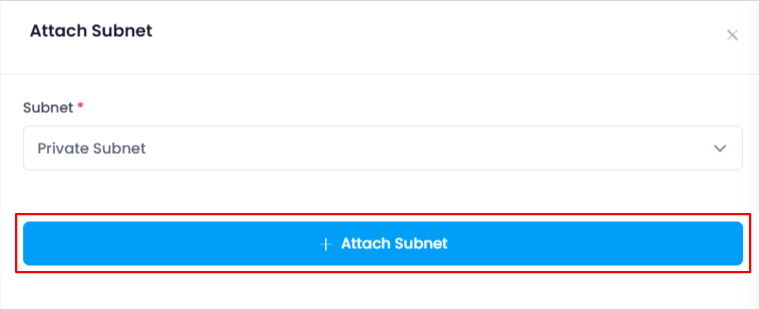
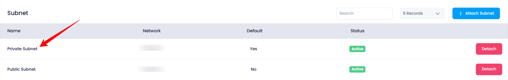

## **How to Attach a Subnet to NAT Gateway**

### **Overview**

Attaching a subnet to a NAT Gateway enables resources in that subnet to use the NAT Gateway for accessing the internet. This guide will walk you through the process of attaching a subnet to a NAT Gateway and verifying the successful attachment.

---

### **1. Login to Utho Cloud Platform**

* Visit the Utho Cloud Platform's **[Login](https://console.utho.com/login)** page.
* Enter your credentials and click  **Login** .
* If you're not registered, sign up  **[here](https://console.utho.com/signup)** .

---

### **2. Navigate to the NAT Gateway Manage Page**

* On the left sidebar of the platform, locate the **VPC** menu.
* Under the **VPC** section, select  **NAT Gateways** .
* This will take you to the  **[NAT Gateway Listing Page](https://console.utho.com/vpc/natgateways "NAT Gateways Listing Page")** , where you can view all the existing NAT Gateways.
* Choose the **NAT Gateway** to which you wish to attach a subnet.
* Click on the **"Manage"** button next to the selected NAT Gateway. This will redirect you to the  **NAT Gateway Manage Page** .
  

---

### **3. Go to the Subnet Tab**

* On the  **NAT Gateway Manage Page** , navigate to the **"Subnet"** tab. Here, you will see a list of subnets currently attached to the NAT Gateway.
  

---

### **4. Click on "Attach Subnet" Button**

* At the top of the subnet list, you will find a button labeled  **"Attach Subnet"** .
* Click on the **"Attach Subnet"** button to open a drawer where you can select a subnet to attach to the NAT Gateway.

---

### **5. Select the Subnet to Attach**

* Inside the drawer, you will see a **dropdown menu** displaying all available subnets that can be attached to the NAT Gateway.
* Choose the **desired subnet** from the dropdown menu.

---

### **6. Attach the Subnet**

* After selecting the subnet, click the **"Attach Subnet"** button to attach the chosen subnet to the NAT Gateway.
* The selected subnet will now be connected to the NAT Gateway, and it will start routing traffic through the NAT Gateway for internet access.

  

---

### **7. Verify the Attachment**

* To verify that the subnet has been successfully attached to the NAT Gateway, return to the **"Subnet"** tab in the  **NAT Gateway Manage Page** .
* You should see the newly attached subnet listed among the attached subnets.

  

---

### **Conclusion**

Attaching a subnet to a NAT Gateway allows the subnet's resources to use the gateway for accessing the internet. By following these simple steps, you can easily attach a subnet to any NAT Gateway, and verify the successful connection from the subnet list.
