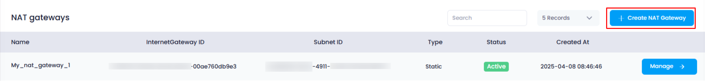
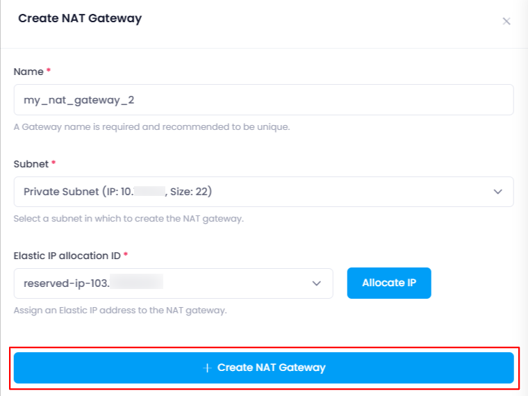
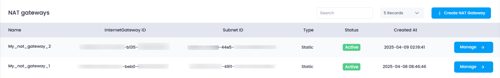

## **How to Create NAT Gateway in Utho Cloud**

### **Overview**

Creating a NAT Gateway in Utho Cloud enables resources in private subnets to access the internet securely while keeping them shielded from direct inbound internet traffic. This guide will walk you through the process of creating a new NAT Gateway, including configuring its name, subnet, and Elastic IP allocation.

---

### **1. Login to Utho Cloud Platform**

* Visit the Utho Cloud Platform's **[Login](https://console.utho.com/login)** page.
* Enter your credentials and click  **Login** .
* If you're not registered, sign up  **[here](https://console.utho.com/signup)** .

---

### **2. Navigate to the NAT Gateway Listing Page**

* On the left sidebar of the platform, find the **VPC** menu.
* Under the **VPC** section, select  **NAT Gateways** .
* Clicking on **NAT Gateways** will take you to the  **NAT Gateway Listing Page** , where you can view all the existing NAT Gateways.

Alternatively, you can directly access the NAT Gateway listing page by clicking this [link to NAT Gateway Listing](https://conjsole.utho.com/vpc/natgateways).

---

### **3. Create a New NAT Gateway**

At the top of the  **NAT Gateway Listing Page** , you'll find a button labeled  **"Create NAT Gateway"** . Clicking this button will open a configuration drawer where you'll need to enter several details for the new NAT Gateway.

---

### **4. Configure the NAT Gateway**

In the configuration drawer, you'll be prompted to provide the following information for the new NAT Gateway:

1. **Name** :

* This field allows you to provide a **name** for your NAT Gateway. It is used to uniquely identify the gateway within your account and helps you manage and reference it later.

2. **Subnet** :

* This is a **dropdown** menu where you can select the **subnet** to which the NAT Gateway will be attached. Only available subnets will be shown here, and you can choose one based on the location and configuration of your resources.

3. **Elastic IP Allocation ID** :

* This dropdown allows you to select an **Elastic IP** that has been allocated previously. If there are no Elastic IPs available, a button labeled **"Allocate IP"** will be shown next to the dropdown. Clicking on this button will generate and allocate a new Elastic IP for the NAT Gateway, which will then be available for selection in the dropdown.

---

### **5. Create the NAT Gateway**

Once all the configuration inputs have been filled, click on the **"Create NAT Gateway"** button. This will initiate the creation of the NAT Gateway with the specified settings.

---

### **6. Verify NAT Gateway Creation**

After the NAT Gateway has been created, you’ll be redirected back to the  **NAT Gateway Listing Page** , where you can verify that your newly created NAT Gateway is listed with the provided details. You can now manage the NAT Gateway as needed.

---

### **Conclusion**

Creating a NAT Gateway in Utho Cloud is a straightforward process that allows your private subnet resources to securely access the internet. By following these steps, you can easily configure the name, subnet, and Elastic IP for your new NAT Gateway. Once created, you can verify and manage the NAT Gateway from the listing page.
