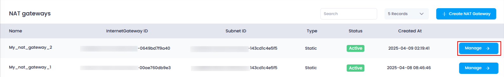
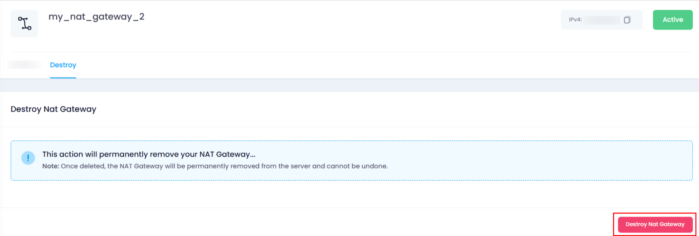
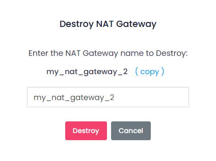
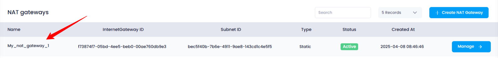

## **How to Destroy a NAT Gateway in Utho Cloud**

### **Overview**

Destroying a **NAT Gateway** in Utho Cloud is a permanent action that will remove the gateway and its associated configurations. This action is typically performed when a NAT Gateway is no longer needed or if you want to clean up unused resources. Once destroyed, any subnets attached to the NAT Gateway will lose internet access.

This guide will walk you through the steps to destroy a NAT Gateway in Utho Cloud.

---

### **1. Login to Utho Cloud Platform**

* Visit the Utho Cloud Platform's **[Login](https://console.utho.com/login)** page.
* Enter your credentials and click  **Login** .
* If you're not registered, sign up  **[here](https://console.utho.com/signup)** .

---

### **2. Navigate to the NAT Gateway Manage Page**

* On the left sidebar of the platform, find the **VPC** menu.
* Under the **VPC** section, click on  **NAT Gateways** .
* This will redirect you to the  **[NAT Gateway Listing Page](https://console.utho.com/vpc/natgateways)** , where you can view all the existing NAT Gateways.
* Select the **NAT Gateway** you wish to destroy.
* Click on the **"Manage"** button next to the selected NAT Gateway to be redirected to the  **NAT Gateway Manage Page** .

  

---

### **3. Go to the Destroy Tab**

* In the  **NAT Gateway Manage Page** , locate the **Destroy** tab.
* Click on the **Destroy** tab to access the option to delete the NAT Gateway.

---

### **4. Destroy the NAT Gateway**

* In the **Destroy** tab, you will find the **"Destroy NAT Gateway"** button.
* Click on this button to initiate the destruction process.

  

---

### **5. Confirmation Popup**

* After clicking the **"Destroy NAT Gateway"** button, a **confirmation popup** will appear.
* The popup will ask for the **exact name** of the NAT Gateway to confirm that you want to destroy it.

  * This is a safety measure to ensure that the correct NAT Gateway is destroyed.
* In the input field, enter the **exact name** of the NAT Gateway as shown on the manage page.

  

---

### **6. Confirm Destruction**

* After entering the NAT Gateway’s name in the input field, click on the **"Destroy"** button in the popup.
* This will permanently destroy the NAT Gateway and remove it from your network.

---

### **7. Verify the NAT Gateway Destruction**

* After the destruction is complete, you will be redirected to the  **NAT Gateway Listing Page** .
* On this page, you can verify whether the NAT Gateway has been successfully deleted.
* If the NAT Gateway is no longer listed, it means it has been successfully destroyed.

  

---

### **Conclusion**

By following these steps, you can destroy a NAT Gateway in Utho Cloud. Destroying the NAT Gateway removes its functionality and configuration, so be sure to confirm that you no longer need the NAT Gateway before proceeding. You can verify the successful destruction by checking the NAT Gateway Listing Page for its removal.
