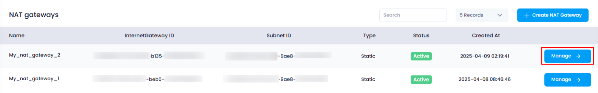
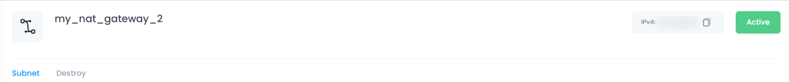

## **Overview of NAT Gateway in Utho Cloud**

### **Overview**

A **NAT Gateway** in Utho Cloud allows resources in a private subnet to access the internet securely while preventing inbound internet traffic. By managing the NAT Gateway, users can control which subnets are attached to it, and ensure their private resources can initiate outbound communication, such as software updates or API calls.

This guide provides an overview of the details and functionalities available on the **NAT Gateway Manage Page** in Utho Cloud.

---

### **1. Login to Utho Cloud Platform**

* Visit the Utho Cloud Platform's **[Login](https://console.utho.com/login)** page.
* Enter your credentials and click  **Login** .
* If you're not registered, sign up  **[here](https://console.utho.com/signup)** .

---

### **2. Navigate to the NAT Gateway Manage Page**

* On the left sidebar of the platform, locate the **VPC** menu.
* Under the **VPC** section, click on  **NAT Gateways** .
* This will redirect you to the  **[NAT Gateway Listing Page](https://console.utho.com/natgateways)** , where you can view all the existing NAT Gateways.
* Select the **NAT Gateway** you want to manage.
* Click on the **"Manage"** button next to the selected NAT Gateway. You will be redirected to the  **NAT Gateway Manage Page** .
  

---

### **3. Key Details on the NAT Gateway Manage Page**

At the top section of the  **NAT Gateway Manage Page** , you’ll find key details and actions related to the selected NAT Gateway:

1. **Name**
   * Displays the name assigned to the NAT Gateway during its creation.
   * This helps you identify and differentiate between multiple NAT Gateways in your environment.
2. **IPv4 Address**
   * Shows the **IPv4 address** associated with the NAT Gateway.
   * This IP address is used for outbound internet communication for resources attached to this NAT Gateway.
3. **Status**
   * Indicates the **status** of the NAT Gateway.
     * **Active** : The NAT Gateway is functioning and available for use.
     * **Inactive** : The NAT Gateway is not active and cannot be used for outbound traffic.

### **4. Tabs Available on the NAT Gateway Manage Page**

On the NAT Gateway Manage Page, there are two primary tabs for managing the NAT Gateway:

#### **1. Subnets Tab**

* This tab displays a list of **subnets** that are currently attached to the NAT Gateway.
* **Functions Available** :
* **View Subnets** : View all subnets that are currently connected to the NAT Gateway.
* **Attach Subnets** : Attach a new subnet to the NAT Gateway to allow it internet access.
* **Detach Subnets** : Detach a subnet from the NAT Gateway to revoke its access to the internet.
* This tab gives you the flexibility to manage which subnets are associated with the NAT Gateway.

#### **2. Destroy Tab**

* This tab provides the option to permanently **destroy** the NAT Gateway.
* If you no longer need the NAT Gateway or if it is associated with any unused or deprecated resources, you can choose to destroy it.
* **Warning** : Destroying the NAT Gateway will terminate its functionality, and any subnets attached to it will lose internet access.

---

### **Conclusion**

The **NAT Gateway Manage Page** in Utho Cloud provides essential information about the NAT Gateway, including its name, status, and IPv4 address. Through the available tabs, you can manage attached subnets and even destroy the NAT Gateway if it's no longer needed. This page helps you maintain control over your network’s outbound internet access, ensuring that your private resources can access the internet securely.
