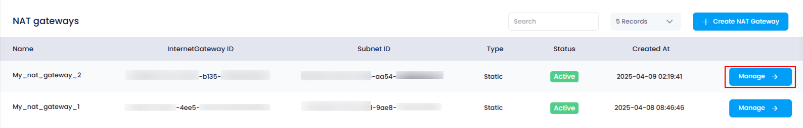
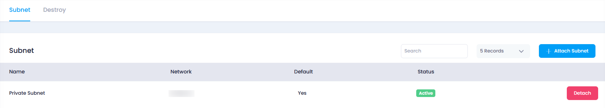

## **How to View Attached Subnets in a NAT Gateway**

### **Overview**

Viewing the attached subnets to a NAT Gateway helps users understand which subnets are using the gateway for internet access. This guide will walk you through the process of viewing the subnets attached to a NAT Gateway, including key information like the subnet's name, network, default status, and more.

---

### **1. Login to Utho Cloud Platform**

* Visit the Utho Cloud Platform's **[Login](https://console.utho.com/login)** page.
* Enter your credentials and click  **Login** .
* If you're not registered, sign up  **[here](https://console.utho.com/signup)** .

---

### **2. Navigate to the NAT Gateway Listing Page**

* On the left sidebar of the platform, find the **VPC** menu.
* Under the **VPC** section, select  **NAT Gateways** .
* Clicking on **NAT Gateways** will take you to the  **NAT Gateway Listing Page** , where you can view all the existing NAT Gateways.

Alternatively, you can directly access the NAT Gateway listing page by clicking this [link to NAT Gateway Listing](https://console.utho.com/vpc/natgateways).

---

### **3. Choose a NAT Gateway to View Attached Subnets**

* On the  **NAT Gateway Listing Page** , select the **NAT Gateway** for which you want to view the attached subnets.
* Click on the **"Manage"** button next to the chosen NAT Gateway. This will redirect you to the  **NAT Gateway Manage Page** .

  

---

### **4. Navigate to the Subnets Tab**

* By default, the **"Subnet"** tab will be selected when you are on the  **NAT Gateway Manage Page** . If not, click on the **"Subnet"** tab to view the list of attached subnets.

---

### **5. View Attached Subnets**

In the  **Subnet Tab** , you'll see a list of subnets that are attached to the selected NAT Gateway. The following information is provided for each attached subnet:

1. **Name** :

* The **Name** refers to the identifier of the attached subnet. It helps you easily recognize the subnet that is associated with the NAT Gateway.

2. **Network** :

* The **Network** field shows the **IP range** assigned to the subnet, represented in CIDR format (e.g., 192.168.1.0/24). This indicates the IP address space of the subnet.

3. **Default** :

* The **Default** field shows whether the subnet is the **default subnet** for the NAT Gateway. It will be marked as "Yes" or "No," indicating whether it is the primary subnet or not.

4. **Status** :

* The **Status** shows whether the subnet is **active** or not. If the subnet is active, it is currently functioning and accessible for traffic routing through the NAT Gateway.

5. **Detach** :

* The **Detach** button allows you to **remove** the subnet from the NAT Gateway. Clicking this button will immediately detach the subnet, without requiring any confirmation.

---

### **6. Conclusion**

By following these steps, you can easily view the subnets attached to a NAT Gateway in Utho Cloud. The **Subnet Tab** in the NAT Gateway Manage Page provides you with key details about each attached subnet, including its name, network configuration, default status, and activity. You can also detach subnets from the NAT Gateway directly from this page.
