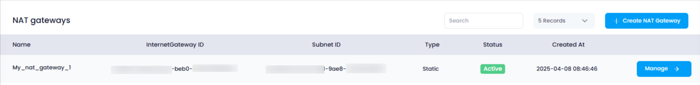

## **How to View NAT Gateways in Utho Cloud**

### **Overview**

Viewing your deployed NAT Gateways in Utho Cloud is essential for managing and troubleshooting the network connectivity between your private subnets and the internet. By accessing the NAT Gateway listing page, users can see all the NAT Gateways created in their account, along with critical details such as the associated Internet Gateway ID, Subnet ID, NAT Gateway Type, and creation date.

---

### **1. Login to Utho Cloud Platform**

* Visit the Utho Cloud Platform's **[Login](https://console.utho.com/login)** page.
* Enter your credentials and click  **Login** .
* If you're not registered, sign up  **[here](https://console.utho.com/signup)** .

---

### **2. Navigate to the NAT Gateway Listing Page**

* On the left sidebar of the platform, locate the **VPC** menu.
* Under the **VPC** section, select  **NAT Gateways** .
* Clicking on **NAT Gateways** will redirect you to the  **NAT Gateway Listing Page** , where you can view all the NAT Gateways created in your account.

Alternatively, you can directly access the NAT Gateway listing page by clicking this [link to NAT Gateway Listing](https://console.utho.com//vpc/natgateways "NAT Gateways Listing Page").

---

### **3. NAT Gateway Listing Page Overview**

On the  **NAT Gateway Listing Page** , you'll see a list of all the NAT Gateways deployed within your account. Each NAT Gateway entry contains the following details:

1. **Name** :

* The **Name** field represents the identifier of the NAT Gateway. This name is set during the NAT Gateway deployment and helps you easily recognize and manage the gateway.

2. **Internet Gateway ID** :

* The **Internet Gateway ID** is the identifier associated with the Internet Gateway that the NAT Gateway uses for internet connectivity. This ID helps you link the NAT Gateway with the Internet Gateway in your network setup.

3. **Subnet ID** :

* The **Subnet ID** represents the ID of the subnet that the NAT Gateway is associated with. This helps you identify which subnet the NAT Gateway is providing internet connectivity to, usually a private subnet.

4. **Type** :

* The **Type** field indicates the type of NAT Gateway. For example, it could be "static" or other types depending on how the gateway is configured.

5. **Created At** :

* The **Created At** field displays the **creation date** of the NAT Gateway. This provides insight into when the gateway was deployed, which can be useful for tracking and auditing purposes.

---

### **Conclusion**

Viewing your NAT Gateways in Utho Cloud is an important step in understanding and managing the network connectivity of your private subnets. The **NAT Gateway Listing Page** provides clear visibility of key details such as the Name, Internet Gateway ID, Subnet ID, NAT Gateway Type, and Creation Date, which are essential for managing your cloud network infrastructure effectively.
