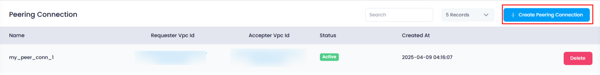
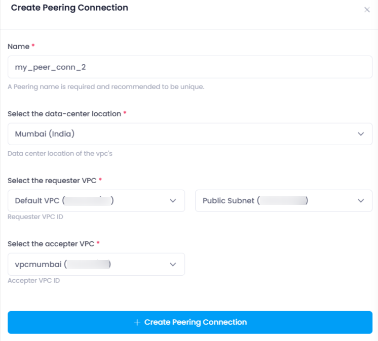
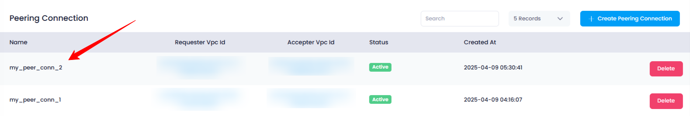

## **How to Create a Peering Connection in Utho Cloud**

### **Overview**

Creating a **Peering Connection** in Utho Cloud allows users to establish secure network communication between two Virtual Private Clouds (VPCs). This process enables you to link different VPCs, facilitating resource sharing and improved network connectivity across your cloud infrastructure.

---

### **1. Login to Utho Cloud Platform**

* Go to the Utho Cloud Platform's  **[Login Page](https://console.utho.com/login)** .
* Enter your credentials and click  **Login** .
* If you don’t have an account, sign up  **[here](https://console.utho.com/signup)** .

---

### **2. Navigate to the Peering Connections Listing Page**

* On the left sidebar, click on **Networking** or  **VPC** , depending on the UI structure.
* Select **Peering Connections** from the submenu.
* You’ll be redirected to the **Peering Connections Listing Page** where you can view all your existing peering connections.

Alternatively, you can access the page directly via this [link to Peering Connections Listing](https://console.utho.com/peeringconnection "Peering Connection Listing").

---

### **3. Click on the "Create Peering Connection" Button**

* At the top of the Peering Connections listing page, click on the **"Create Peering Connection"** button.
* This action will open a drawer with the necessary configuration options for creating a new peering connection.

  

---

### **4. Configure the Peering Connection**

In the drawer, you will need to provide the following details:

1. **Name**
   * Enter a name for the peering connection. This name helps identify the connection within your account.
2. **Data Center Location**
   * Select the **Data Center Location** from a dropdown list of available data centers. This specifies where the peering connection will be established geographically.
3. **Requester VPC**
   * Choose the **Requester VPC** from a dropdown list of your available VPCs. If the selected VPC has any subnets, a secondary dropdown will appear allowing you to select the  **Requester Subnet** .
4. **Accepter VPC**
   * Similarly, choose the **Accepter VPC** from a dropdown list of your VPCs. If this VPC has subnets, a dropdown to select the **Accepter Subnet** will also appear.

---

### **5. Create the Peering Connection**

* After filling in the necessary details, click on the **"Create Peering Connection"** button.
* This will create the peering connection and add it to your list of peering connections.

---

### **6. Verify the Peering Connection**

* You can verify the newly created peering connection in the  **Peering Connections Listing Page** .
* The connection will be listed along with its status, requester and accepter VPCs, and other relevant details.

  

---

### **Conclusion**

Creating a peering connection in Utho Cloud is a straightforward process that helps you securely link VPCs for shared resources and seamless communication. By following the steps outlined, you can easily configure, create, and verify peering connections within your cloud environment.
