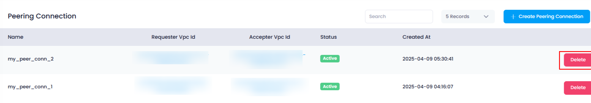
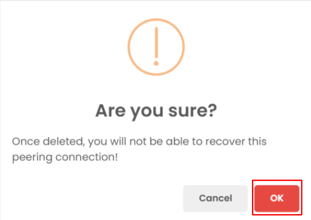
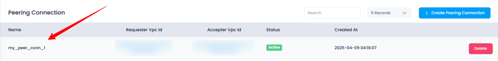

## **How to Delete a Peering Connection in Utho Cloud**

### **Overview**

Deleting a **Peering Connection** in Utho Cloud allows you to permanently remove a network link between two VPCs. This is useful when the connection is no longer required, helping to maintain a clean and secure network environment.

---

### **1. Login to Utho Cloud Platform**

* Go to the **[Login Page](https://console.utho.com/login)** of the Utho Cloud Platform.
* Enter your credentials and click  **Login** .
* If you don't have an account yet, register  **[here](https://console.utho.com/signup)** .

---

### **2. Navigate to the Peering Connections Listing Page**

* From the left sidebar menu, navigate to **Networking** or  **VPC** , depending on your dashboard layout.
* Click on **Peering Connections** to open the  **Peering Connections Listing Page** .
* You can also access it directly using this [link to Peering Connections Listing](https://console.utho.com/peeringconnection)

---

### **3. Delete a Peering Connection**

* On the listing page, each peering connection in the list will have a **Delete** button located at the end of its row.
* Click on the **Delete** button next to the peering connection you wish to remove.

  

---

### **4. Confirm Deletion**

* A confirmation popup will appear asking if you’re sure about deleting the peering connection.
* Click on the **"OK"** button in the popup to confirm.
* This will destroy the peering connection permanently.

  

---

### **5. Verify Deletion**

* After deletion, the peering connection will be removed from the list.
* You can verify the successful deletion by checking the **Peering Connections Listing Page** — the removed item will no longer appear.

  

---

### **Conclusion**

Deleting a peering connection in Utho Cloud is simple and quick. By using the Delete button followed by confirmation, you can safely remove unnecessary network links and keep your infrastructure organized.
