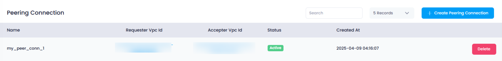

## **How to View Peering Connections in Utho Cloud**

### **Overview**

Viewing your **Peering Connections** in Utho Cloud allows users to manage network communications between VPCs. From the **Peering Connections** listing page, users can see all active and inactive connections, including vital details like requester and accepter VPC IDs, status, and creation date.

---

### **1. Login to Utho Cloud Platform**

* Go to the Utho Cloud Platform's  **[Login Page](https://console.utho.com/login)** .
* Enter your credentials and click  **Login** .
* Don’t have an account? You can sign up  **[here](https://console.utho.com/signup)** .

---

### **2. Navigate to the Peering Connections Listing Page**

* From the left sidebar, click on **Networking** or  **VPC** , depending on the UI structure.
* Then select **Peering Connections** from the submenu.
* You will be redirected to the **Peering Connections Listing Page** where all configured peering connections are displayed.

Alternatively, you can access the page directly via this [link to Peering Connections Listing](https://console.utho.com/vpc/peeringconnection)

---

### **3. Peering Connections Listing Page Overview**

On this page, you’ll see a table listing all existing peering connections. Each entry includes the following details:

1. **Name**
   * The name given to the peering connection at the time of creation.
   * Useful for identifying connections in large networks.
2. **Requester VPC ID**
   * The ID of the VPC that initiated the peering request.
   * This indicates the source of the peering traffic.
3. **Accepter VPC ID**
   * The ID of the VPC that accepted the peering connection.
   * This indicates the destination VPC of the peering connection.
4. **Status**
   * Shows whether the peering connection is currently **Active** or  **Inactive** .
   * Helps monitor the health and availability of the connection.
5. **Created At**
   * The timestamp of when the peering connection was created.
   * Useful for auditing and tracking purposes.

     

---

### **Conclusion**

The **Peering Connections Listing Page** in Utho Cloud offers a centralized view to monitor and manage inter-VPC communication. Whether you're debugging traffic flow or reviewing network architecture, this page provides all the essential information in one place. Ensure that all active connections are verified and functioning as intended for seamless cross-VPC operations.
