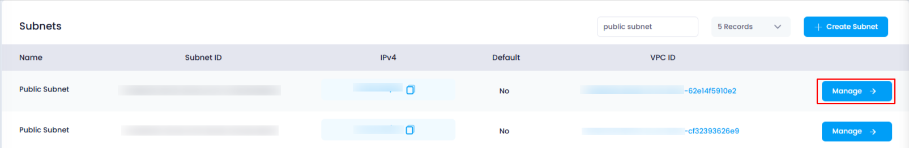
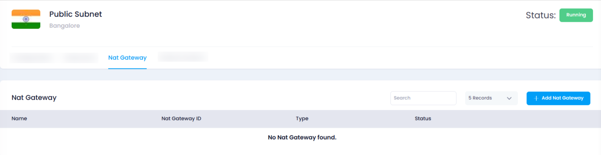
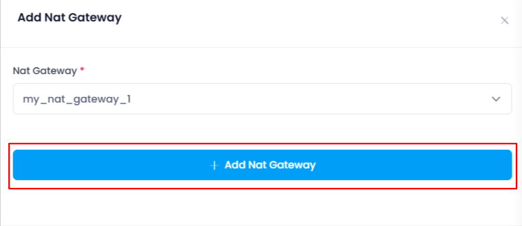
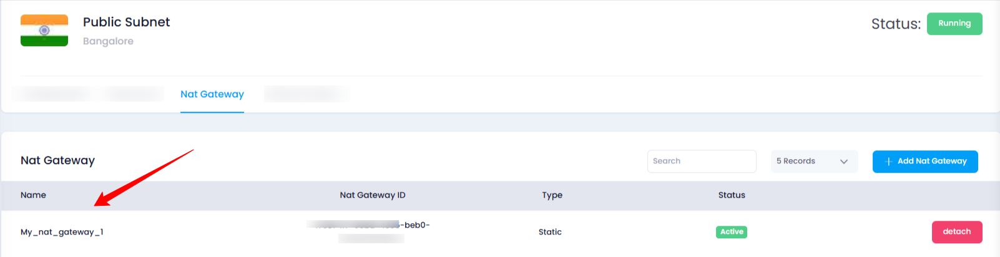

## **How to Attach a NAT Gateway to a Subnet in Utho Cloud**

### **Overview**

Attaching a NAT Gateway to a subnet in Utho Cloud allows resources within the subnet to access the internet via the NAT Gateway, ensuring efficient management of outbound traffic. By following a few simple steps, users can easily attach a NAT Gateway to a subnet and verify the attachment.

---

### **1. Login to Utho Cloud Platform**

* Visit the Utho Cloud Platform's **[Login](https://console.utho.com/login)** page.
* Enter your credentials and click  **Login** .
* If you're not registered, sign up  **[here](https://console.utho.com/signup)** .

---

### **2. Navigate to the Subnet Listing Page**

* On the left sidebar of the platform, look for the **VPC** menu item.
* Under the **VPC** section, select **Subnets** (subsection).
* Clicking on **Subnets** will redirect you to the  **Subnets Listing Page** , where you can view all the subnets created within your account.

You can also access the Subnets listing directly by clicking this [link to Subnet Listing](https://console.utho.com/bpc/subnets "Subnet Listing Page").

---

### **3. Select the Subnet and Open the Manage Page**

* In the  **Subnets Listing Page** , choose the subnet to which you want to attach a NAT Gateway.
* At the end of the subnet item, click the **"Manage"** button to open the **Manage Page** of that subnet.

  

---

### **4. Navigate to the "NAT Gateway" Tab**

* On the **Manage Page** of the subnet, locate and click on the **"NAT Gateway"** tab.
* This tab will display the list of NAT Gateways currently attached to the subnet.

  

---

### **5. Add a NAT Gateway to the Subnet**

* In the **"NAT Gateway"** section, click the **"Add NAT Gateway"** button.
* This will open a drawer where you can configure the NAT Gateway to attach.
* In the drawer, you will see a dropdown titled **"NAT Gateway"** that lists all the available NAT Gateways.
* Select a NAT Gateway from the list that you wish to attach to the subnet.

  After selecting the desired NAT Gateway from the dropdown, click the **"Add NAT Gateway"** button.

  

---

### **6. Verify the Attachment**

* This will attach the selected NAT Gateway to the subnet.
* A success notification will appear confirming the attachment.
* To verify, go back to the **"NAT Gateway"** tab and check the list of attached NAT Gateways. You should see the newly added NAT Gateway in the list.

  

---

### **Conclusion**

Attaching a NAT Gateway to a subnet in Utho Cloud is a simple process. By following these steps, users can quickly link a NAT Gateway to their desired subnet and verify the attachment. This allows your subnet's resources to communicate efficiently with the internet while maintaining security and control over outbound traffic.
