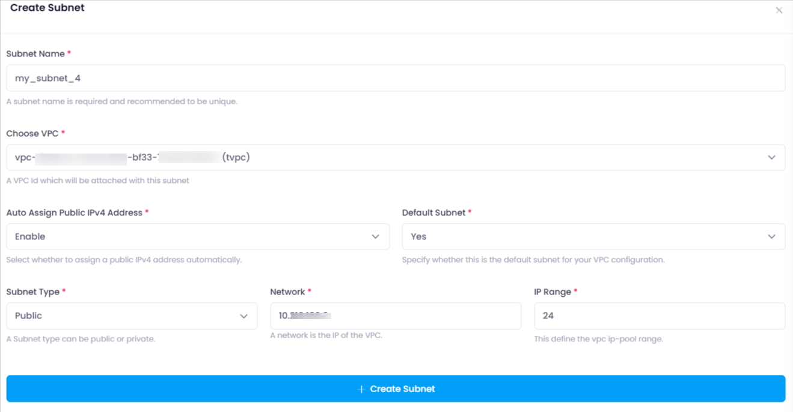
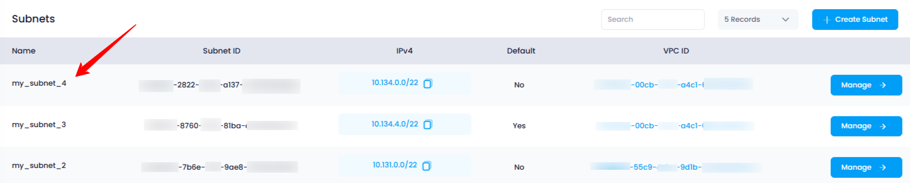

### **1. Login to Utho Cloud Platform**

* Visit the Utho Cloud Platform's **[Login](https://console.utho.com/login)** page.
* Enter your credentials and click  **Login** .
* If you're not registered, sign up  **[here](https://console.utho.com/signup)** .

---

### **2. Navigate to the Subnets Listing Page**

* On the left sidebar of the platform, look for the **VPC** menu item.
* Under the **VPC** section, select **Subnets** (subsection).
* Clicking on **Subnets** will redirect you to the  **Subnets Listing Page** , where you can view all the subnets created within your account.

You can also access the Subnets listing directly by clicking this [link to Subnet Listing]( "Subnets Listing Page").

---

### **3. Create a Subnet**

On the  **Subnets Listing Page** , follow these steps to create a new subnet:

1. **Click the "Create Subnet" Button**

   * On the top of the subnet list, you’ll see a button labeled  **"Create Subnet"** .
   * Click this button to open the **Create Subnet** drawer where you can configure your new subnet.
2. **Configure Subnet Settings**
   In the drawer that opens, you will need to fill in the following details for your new subnet:

   * **Subnet Name** :
     * Enter a **unique name** for your subnet.
     * This helps you identify and manage your subnet, especially when there are multiple subnets in the same VPC.
   * **Choose VPC** :
     * A **dropdown menu** will appear, allowing you to select the VPC to which this subnet will belong.
     * Choose the appropriate VPC where the subnet will be created.
   * **Auto Assign Public IPV4 Address** :
     * This is a **dropdown** with two options: **Enable** or  **Disable** .
     * Select **Enable** if you want the subnet to automatically assign public IP addresses to resources within this subnet (useful for public-facing resources).
   * **Default Subnet** :
     * This is a **dropdown** to select between **Yes** or  **No** .
     * Choose **Yes** if this subnet will be the default subnet for your VPC, or **No** if it will be a secondary subnet.
   * **Subnet Type** :
     * This is a **dropdown** with two options: **Public** or  **Private** .
     * Choose **Public** if you want the subnet to have internet access, or **Private** if you want the subnet to be isolated from the public internet.
   * **Network** :
     * An **input box** will appear where you can enter the **IP range** for your subnet.
     * This should be in CIDR format (e.g., `10.0.0.0`), defining the available IP address space within the subnet.
   * **IP Range** :
     * A **numeric input field** will appear where you can specify the **subnet mask** (e.g., 24, 22) to define the size of the subnet.

   
3. **Click "Create Subnet"**

   * After filling in all the required fields, click the **"Create Subnet"** button.
   * This will trigger the creation of the subnet, and a success message will appear once the process is complete.
4. **Verify Subnet Creation**

   * After the subnet has been created successfully, you can verify it by going back to the  **Subnets Listing Page** .
   * The newly created subnet should now appear in the list of subnets, along with the details you configured.
     

---

### **Conclusion**

Creating a subnet in Utho Cloud allows you to segment your VPC into smaller, manageable network sections. By following the simple steps outlined above, you can easily create subnets with customized configurations, such as network ranges, subnet types, and public IP address assignments. Once created, the subnet will be listed on the Subnets Listing Page for easy management and configuration
