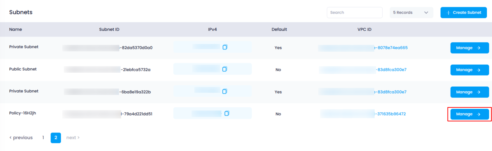
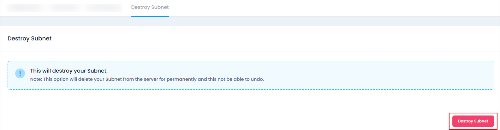
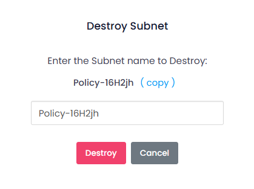
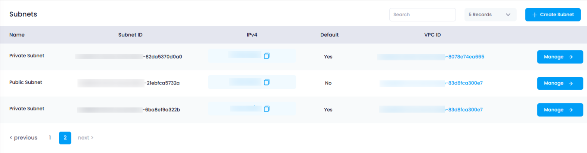

## **How to Destroy Subnet in Utho Cloud**

### **Overview**

Destroying a subnet in Utho Cloud allows users to permanently remove a subnet from their VPC configuration. This is useful when no longer needing a subnet or when performing cleanup operations. In this guide, we'll walk through the steps required to destroy a subnet, ensuring that you can easily remove unwanted subnets from your network infrastructure.

---

### **1. Login to Utho Cloud Platform**

* Visit the Utho Cloud Platform's **[Login](https://console.utho.com/login)** page.
* Enter your credentials and click  **Login** .
* If you're not registered, sign up  **[here](https://console.utho.com/signup)** .

---

### **2. Navigate to the Subnet Listing Page**

* On the left sidebar of the platform, look for the **VPC** menu item.
* Under the **VPC** section, select **Subnets** (subsection).
* Clicking on **Subnets** will redirect you to the **Subnet Listing Page** where you can view all the subnets you have created.

You can also access the Subnet listing directly by clicking this [link to Subnet Listing](https://console.utho.com/vpc/subnets "Subnets Listing Page").

---

### **3. Choose the Subnet to Destroy**

* On the  **Subnet Listing Page** , locate the subnet you want to destroy.
* At the end of the subnet entry, click on the **"Manage"** button to go to the manage page of that subnet.

  

---

### **4. Go to the "Destroy Subnet" Tab**

* In the manage page of the selected subnet, you will see several tabs.
* Click on the **"Destroy Subnet"** tab to begin the process of destroying the subnet.

  

---

### **5. Destroy the Subnet**

* On the **"Destroy Subnet"** tab, you will find a button titled  **"Destroy Subnet"** .
* Clicking this button will open a  **confirmation popup** .

---

### **6. Confirmation Popup**

* In the confirmation popup, you will be asked to enter the **exact name of the subnet** you wish to destroy.
* After entering the name of the subnet correctly, click on the **"Destroy"** button to confirm the action.

  

---

### **7. Verify the Subnet is Destroyed**

* After the destruction is successful, you will be redirected back to the  **Subnet Listing Page** .
* The destroyed subnet will no longer be listed in the subnets list.
* You can verify that the subnet has been destroyed by checking the updated listing of subnets.

  

---

### **Conclusion**

Destroying a subnet in Utho Cloud is a straightforward process, but it is crucial to ensure you are deleting the correct subnet, as this action cannot be undone. By following the steps above, you can safely and effectively remove a subnet from your network configuration. Always verify the changes by checking the subnet listing after destruction.
