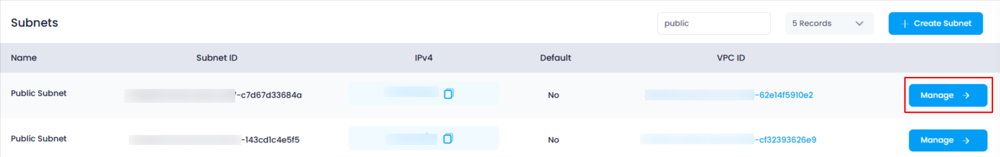
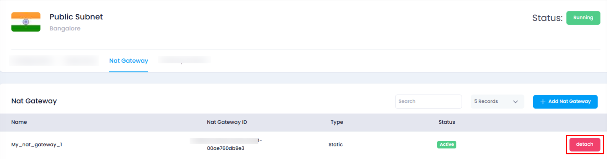
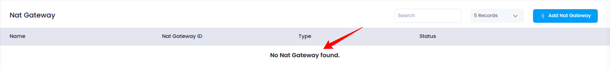

## **How to Detach NAT Gateway from Subnet**

### **Overview**

Detaching a NAT Gateway from a subnet in Utho Cloud can be done quickly through the subnet's management page. This action removes the NAT Gateway from the subnet without requiring any confirmation. Follow the steps below to detach a NAT Gateway from your subnet.

---

### **1. Login to Utho Cloud Platform**

* Visit the Utho Cloud Platform's **[Login](https://console.utho.com/login)** page.
* Enter your credentials and click  **Login** .
* If you're not registered, sign up  **[here](https://console.utho.com/signup)** .

---

### **2. Navigate to the Subnet Listing Page**

* On the left sidebar of the platform, look for the **Subnets** menu item under the **VPC** section.
* Click on **Subnets** to open the **Subnet Listing Page** where all the subnets created within your VPC are listed.

You can also directly access the Subnet listing by clicking this [link to Subnet Listing](https://console.utho.com/vpc/subnets "Subnets Listing Page").

---

### **3. Go to the Manage Page of the Subnet**

* In the  **Subnet Listing Page** , find the subnet for which you want to detach a NAT Gateway.
* Click the **"Manage"** button at the end of the subnet’s entry to go to the subnet’s manage page.

  

---

### **4. Navigate to the NAT Gateway Tab**

* In the manage page of the subnet, locate the **"NAT Gateway"** tab. This tab will contain a list of all the NAT Gateways that are currently attached to the subnet.

  

---

### **5. Detach the NAT Gateway**

* In the  **NAT Gateway tab** , you will see all the NAT Gateways that are attached to the subnet.
* At the end of each attached NAT Gateway, there is a **"Detach"** button.
* Click the **"Detach"** button next to the NAT Gateway you want to remove.
* The NAT Gateway will be immediately detached from the subnet without any confirmation prompt or further action.

---

### **6. Verify the Detachment**

* After detaching the NAT Gateway, you can verify that the action was successful by reviewing the updated list of attached NAT Gateways.
* The NAT Gateway you detached will no longer appear in the list, confirming it has been successfully removed from the subnet.

  

---

### **Conclusion**

Detaching a NAT Gateway from a subnet is a straightforward process in Utho Cloud. Simply navigate to the **NAT Gateway tab** in the subnet's manage page, click **Detach** next to the NAT Gateway you wish to remove, and it will be immediately detached. No confirmation is required for this action, making it quick and efficient to manage your network configurations.
