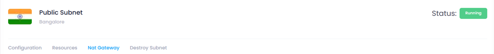

## **Overview of the Subnet Manage Page**

### **Introduction**

The **Subnet Manage Page** in Utho Cloud provides a comprehensive view of your subnet’s details and offers various configuration options. It allows you to manage the subnet's settings, view attached resources, manage NAT gateways, and destroy the subnet when no longer needed.

---

### **Subnet Information**

1. **Name of the Subnet** :

* The **name** displayed represents the identifier of the subnet. It is provided during the creation of the subnet and helps in identifying and managing subnets easily in your VPC configuration.

2. **DC Location of the Subnet** :

* The **data center (DC) location** indicates the geographical region where the subnet has been deployed. This information helps in understanding the physical location of your subnet and its associated resources.

3. **Status of the Subnet** :

* The **status** indicates whether the subnet is **active** or inactive. When the subnet is  **Running** , it is actively functioning and available for use within the VPC.

---

### **Tabs for Further Configuration**

1. **Configuration Tab**:

* This tab displays the **configuration details** of the subnet, including all the settings configured during the creation of the subnet. These settings provide insights into the subnet’s network range, type, and other key attributes.

2. **Resources Tab**:

* The **Resources** tab lists all the **resources** (such as cloud servers, etc.) that are attached to the subnet. This allows you to track and manage which resources are using the subnet.

3. **NAT Gateway Tab**:

* The **NAT Gateway** tab shows a list of all the **NAT Gateways** attached to the subnet. It also provides options to **attach** or **detach** a NAT gateway to/from the subnet. This enables seamless network routing and management for your resources.

4. **Destroy Subnet Tab**:

* The **Destroy Subnet** tab contains the option to  **permanently destroy the subnet** . This action is irreversible, and it requires confirmation to ensure that the subnet is not destroyed accidentally. The subnet will be deleted, and all resources attached to it will also be affected.

---

### **Conclusion**

The Subnet Manage Page in Utho Cloud offers an intuitive interface for managing your subnet’s settings and configurations. The information provided in the top section of the page gives you a quick overview of the subnet’s status and configuration, while the four tabs allow you to configure further, view resources, manage NAT gateways, and delete the subnet when required.

By utilizing these options, you can effectively manage and control your subnet in Utho Cloud, ensuring your network architecture is tailored to your needs.
